# Taming Tokenization
### (for Hindi [Devanagari script])


### HuggingFace App
[🤗 Spaces App](https://huggingface.co/spaces/Manu101/HindiTokenizer)


#### (Tokenization... the gnarly part of every NLP model ... with NLTK back in pre-transformer days and now with LLMs)

For example, the string Hello world! gets encoded by the GPT-2 tokenizer as the sequence [15496, 995, 0], meaning that
it's a sequence of three tokens, the first of which is the 15,946th token of the vocabulary, or Hello, the second of
which is the 995th token of the vocabulary, or world, and the third of which is the 0th token of the vocabulary, or !.

In general, a long string being represented by a single token implies that that string appears a lot in the training
set (or whatever corpus was used to build the tokenizer), because otherwise it wouldn't have been "worth it" to give
that string its own token.

#### Used basic Hindi alphabet as part of vocab initialization:
```
self.hindi_varnmala_and_key_units = dedent("""
                    अ आ इ ई उ ऊ ए ऐ ओ औ अं अः ऋ ॠ
                    ा ि ी ु ू ृॄ ॅॆ े ैॉ ॊ ो ौ                     
                    क ख ग घ ङ क़ ख़ ग़ घ़ ङ़
                    च छ ज झ ञ ज़ झ़ ञ़
                    ट ठ ड ढ ण ड़ ढ़ ण़
                    त थ द ध न त़ थ़ द़ ध़ ऩ
                    प फ ब भ म प़ फ़ ब़ म़
                    य र ल ळ व य़ ऱ ल़ ऴ व़
                    श ष ॺ स ह श़ ष़ स़ ह़
                    ० १ २ ३ ४ ५ ६ ७ ८ ९ 
                    ॥
                    """)
```


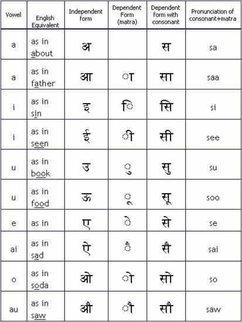

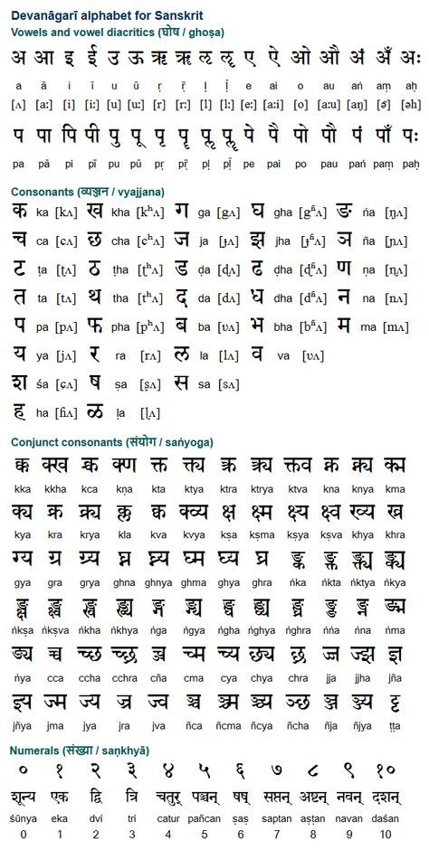

## Some info about devanagari script:

src : https://hindilanguage.info/devanagari/

1. The ordering of the letters is according to (some) precise scientific principles.
2. Each letter transcribes a distinct sound.
3. It recognizes subtle distinctions in sound.

## Hindi Alphabet:

##### 


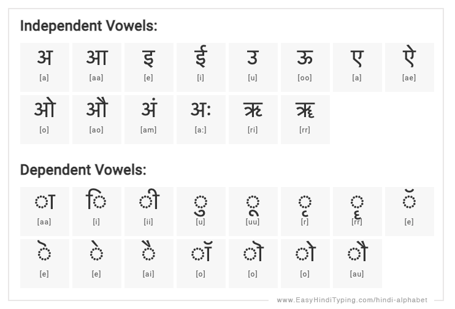

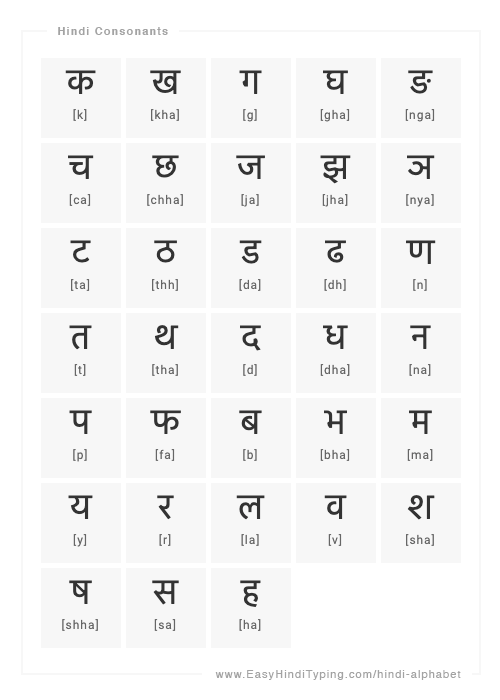

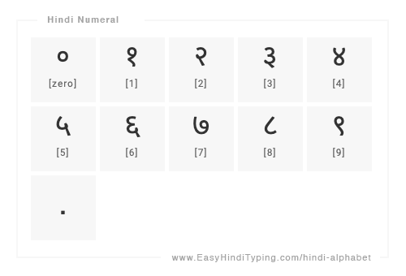

## Important for getting info on UTF-8 and encoding in general

1. [2003 blog from co-founder and ex-CEO (2010-2019) of Stackoverflow : The Absolute Minimum Every Software Developer Absolutely, Positively Must Know About Unicode and Character Sets (No Excuses!)](https://www.joelonsoftware.com/2003/10/08/the-absolute-minimum-every-software-developer-absolutely-positively-must-know-about-unicode-and-character-sets-no-excuses/)
2. [StackOverflow QnA: some good answers](https://stackoverflow.com/questions/2241348/what-are-unicode-utf-8-and-utf-16)
3. https://medium.com/free-code-camp/a-beginner-friendly-guide-to-unicode-d6d45a903515

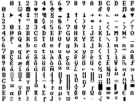

----
> Code points are the key concept of Unicode, which was “designed to support the worldwide interchange, processing, and
> display of the written texts of the diverse languages…of the modern world.”

> It does so by associating virtually every printable character with an unique code point. Together, these characters
> comprise the Unicode character set.
----

### A great source for learning on Tokenization and BPE: [Andrej Karpathy's lecture](https://www.youtube.com/watch?v=zduSFxRajkE&themeRefresh=1)

## Fun with glitch tokens:

1. 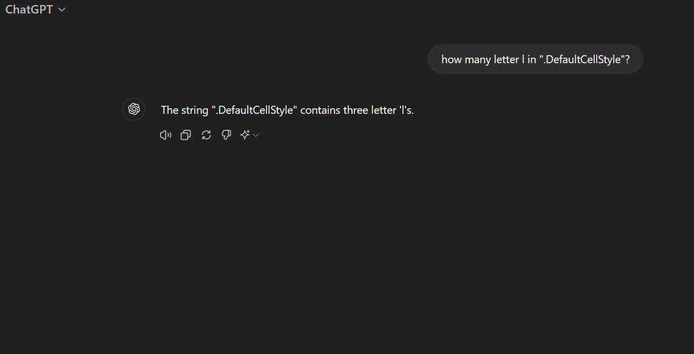
2. 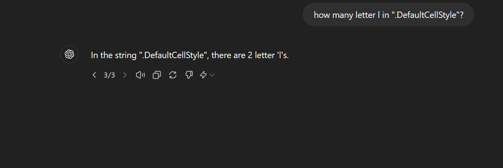
3. 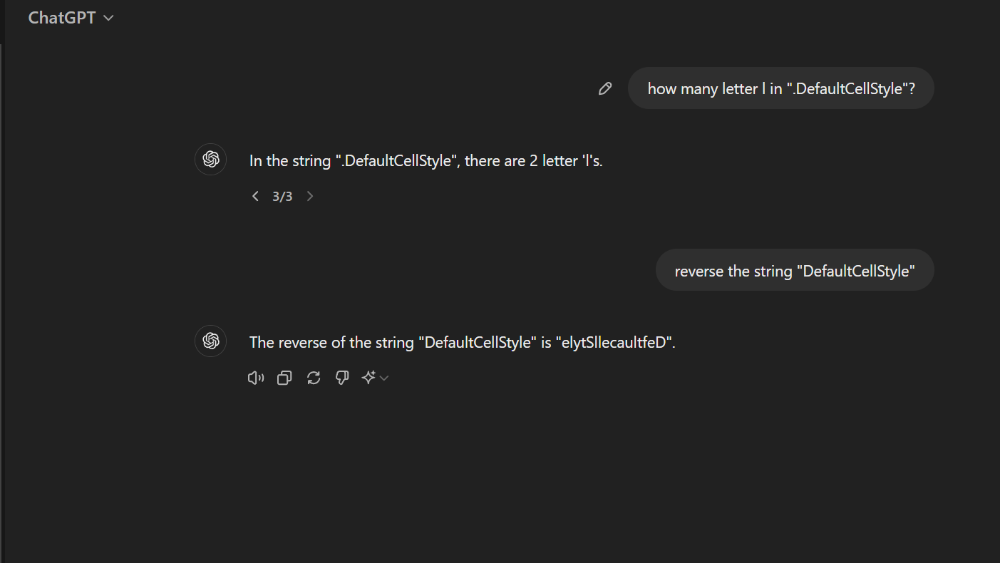
4. 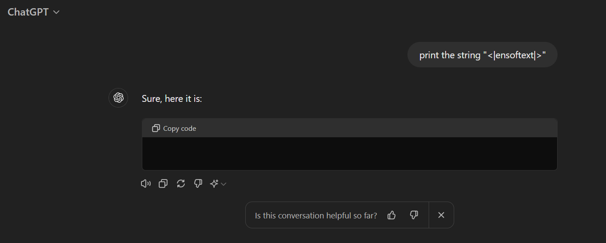

#### Why this breaks things???

src: https://news.ycombinator.com/item?id=36245187
"But why would that break things like this? Answer from londons_explore on Hacker News:

> These glitch tokens are all near the centroid of the token embedding space. That means that the model cannot really
> differentiate between these tokens and the others equally near the center of the embedding space, and therefore when
> asked to ’repeat’ them, gets the wrong one.

> That happened because the tokens were on the internet many millions of times (the davidjl user has 163,000 posts on
> reddit simply counting increasing numbers), yet the tokens themselves were never hard to predict (and therefore while
> training, the gradients became nearly zero, and the embedding vectors decayed to zero, which some optimizers will do
> when normalizing weights).

> ...Almost all of the tokens which produce anomalous behavior in GPT-2 and GPT-3 don't produce anomalous behavior in
> the later models, because rather than being a single weird token, they're broken up into many, more normal tokens. For
> example, SolidGoldMagikarp was encoded as a the single token SolidGoldMagikarp by the old tokenizer, but is encoded as
> five tokens by the new tokenizer: [' Solid', 'Gold', 'Mag', 'ik', 'arp'].
> Each of those five tokens is normal and common, so GPT-4 handles them just fine.

> ... the later tokens, being longer, rarer, and weirder, are easier to use to create prompts that are far from the
> model's training distribution.
(src: https://www.lesswrong.com/posts/ChtGdxk9mwZ2Rxogt/smartyheadercode-anomalous-tokens-for-gpt3-5-and-gpt-4-1)


# Points to note:

1. Code points are the key concept of Unicode, which was “designed to support the worldwide interchange, processing, and
   display of the written texts of the diverse languages…of the modern world.” It does so by associating virtually every
   printable character with an unique code point. Together, these characters comprise the Unicode character set.

2. Code points are typically written in hexadecimal and prefixed with U+ to denote the connection to Unicode : ,
   emojis [🙌 | code point: U+1F64C]

3. Glyphs Are What You See

4. The actual on-screen representation of code points are called glyphs, (the complete mapping of code points to glyphs
   is known as a font). Glyphs are the physical manifestation of a character. This guy 💩 is a glyph. A font is a mapping
   of code points to glyphs.

5. 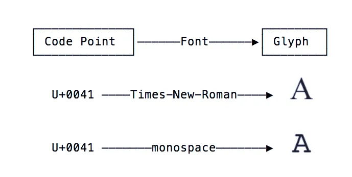

6. Under the hood, all variations of the face with open mouth emoji point to the same code point, U+1F62E, but the glyph
   representing it varies by platform 😮.

7. Code Points are Abstractions: Because they say nothing about how they are rendered visually (requiring a font and a
   glyph to “bring them to life”), code points are said to be an abstraction.

8. This is because code points require a character encoding to convert them into the one thing which computers can
   interpret: bytes.

9. UTF-8 uses a set of rules to convert a code point into an unique sequence of (1 to 4) bytes, and vice versa. Code
   points are said to be encoded into a sequence of bytes, and sequences of bytes are decoded into code points.

10. UTF-8 and UTF-16 encodings of emoji 😮: 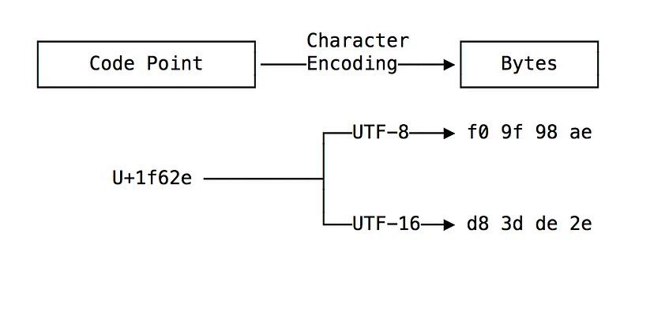

11. In order to send them across the network or save them in a file, characters and their underlying code points must be
    encoded into bytes. A character encoding contains the details of how a code point is embedded into a sequence of
    bytes.

12. 

13. 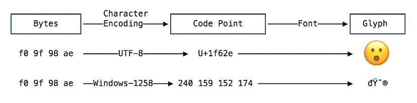

14. If you are working with code points, know that those code points must be encoded into bytes with a character
    encoding.

15. If you have a sequence of bytes representing text, know that those bytes are meaningless without knowing the
    character encoding that was used create those bytes.

    

## Devanagari script & Unicode(links) :

1. [Devanagari](https://unicode.org/charts/PDF/U0900.pdf)  Range: 0900–097F
2. [Devanagari Extended](https://unicode.org/charts/PDF/UA8E0.pdf)  Range: A8E0–A8FF
3. https://en.wikipedia.org/wiki/Plane_%28Unicode%29#Basic_Multilingual_Plane
4. https://en.wikipedia.org/wiki/Devanagari_(Unicode_block)
5. Finding 'अ' Unicode code point value
   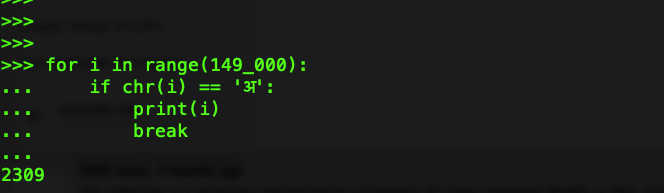


## Regex info for code point classes:

src: https://www.regular-expressions.info/unicode.html

1. Most people would consider `à` a single character. Unfortunately, it need not be depending on the meaning of the word
   “character”.

2. All Unicode regex engines treat any single Unicode code point as a single character. When online sources say that the
   dot matches any single character, this translates into Unicode parlance as “the dot matches any single Unicode code
   point”. In Unicode, à can be encoded as two code points: U+0061 (a) followed by U+0300 (grave accent). In this
   situation, `.` applied to `à` will match a without the accent. ^.$ will fail to match, since the string consists of
   two code points. ^..$ matches à.
3. The Unicode code point U+0300 (grave accent) is a combining mark.
4. Any code point that is not a combining mark can be followed by any number of combining marks. This sequence, like
   U+0061 U+0300 above, is displayed as a single **grapheme** on the screen.
5. To match a specific Unicode code point, use `\uFFFF` where `FFFF` is the hexadecimal number of the code point you
   want to match.
6. You must always specify 4 hexadecimal digits E.g. \u00E0 matches à, but only when encoded as a single code point
   U+00E0.
7. Since `\x` by itself is not a valid regex token, `\x{1234}` can never be confused to match `\x` 1234 times.
8. **Unicode Categories**
    1. each Unicode character belongs to a certain category.
    2. You can match a single character belonging to the “letter” category with `\p{L}`
    3. you can match a single character not belonging to that category with `\P{L}`
    4. Again, “character” really means “Unicode code point”
    5. `\p{L}` matches a single code point in the category `“letter”`
    6. If your input string is `à` encoded as U+0061 U+0300, it matches a without the accent
    7. If the input is `à` encoded as U+00E0, it matches à with the accent
    8. The reason is that both the code points U+0061 (a) and U+00E0 (à) are in the category “letter”, while U+0300 is
       in the category “mark”.

### Unicode Scripts:

1. The Unicode standard places each assigned code point (character) into one script
2. A script is a group of code points used by a particular human writing system
3. Some scripts like `Thai` correspond with a _single_ human language
4. Other scripts like `Latin` span _multiple languages_
5. Some languages are composed of multiple scripts
6. There is **no** Japanese Unicode script
7. Instead, Unicode offers the Hiragana, Katakana, Han, and Latin scripts that Japanese documents are usually composed
   of
8. A special script is the `Common` script. This script contains all sorts of characters that are common to a wide range
   of scripts. It includes all sorts of punctuation, whitespace and miscellaneous symbols.


#### 100k GPT-4 Tokens list: https://gist.github.com/s-macke/ae83f6afb89794350f8d9a1ad8a09193

#### LLAMA3 Tokenizer in browser: https://belladoreai.github.io/llama3-tokenizer-js/example-demo/build/

## Resources for dataset preparation:

Note: Previously used Git Large File System, easy to use and track specific files

GDrive link for dataset: [Dataset Download](https://drive.google.com/file/d/1yaAeNfw-8NZZwrcs_tWrBxTIHyI2n2k4/view?usp=sharing)

Note: file named as 01... and Z are intentional to order reading those specific files, for example 01 has Hindi alphabet (again) and their overview, while files with 'Z' have Hinglish text and hence must be used to build vocab at later stages (after learning sufficient Hindi and English separately).


1. [hindi_text_ltrc](https://github.com/cltk/hindi_text_ltrc/tree/master)
    1. contains classical texts
    2. Kabeera
    3. Rahim
    4. Tulsidaas
    5. Meera
    6. Jayasl
    7. cakra

2. [Short Hindi stories from this link](https://worldstories.org.uk/lang/hindi)
    1. बंदर और मगरमच्छ
    2. खोया हुआ ऊँट
    2. घंमडी मोर
    3. चालाक बूढ़ी औरत
    4. जोहा और उसका गधा
    5. तीन बकरे जिनका नाम ग्रफ्फ था
    6. दयालु बकरियां
    7. बंदरों का राजा और भूत
    8. फ़ीनिक्स चिड़िया
    9. सच्चा होना
    10. सूरज और चंदा आसमान में क्यों रहते हैं

3. https://thehindigiri.com/he-bharat-ke-ram-jago/
4. https://storymirror.com/read/hindi/story/meraa-vtn/y3tv2cqj
4. https://www.kathaamrit.com/laziness-story-for-kids-in-hindi/
5. https://www.kathaamrit.com/elephant-and-car-story/
6. https://www.kathaamrit.com/friendship-story-for-kids/
7. https://www.kathaamrit.com/fairy-tail-story-for-kids/
8. https://www.kathaamrit.com/category/panchatantra-stories/
9. https://www.kathaamrit.com/category/spiritual-knowledge/chalisa/
10. https://www.kathaamrit.com/category/spiritual-knowledge/bhajan/
11. https://www.kathaamrit.com/pita-ki-seekh/
12. https://www.kathaamrit.com/panchtantra-kahaniya-hindi/
13. https://www.kathaamrit.com/panchtantra-ki-kahani/
14. https://storymirror.com/read/hindi/story/raamraajy/meho36ge
15. Complete first 5 parts from Rashmirathi: https://www.ishangirdhar.com/rashmi-rathi/
16. Another by Dinkar: https://hindi-kavita.com/HindiParshuramKiPrateekshaDinkar.php#Parshuram11
17. [वर्णमाला](https://anp.wikipedia.org/wiki/%E0%A4%B5%E0%A4%B0%E0%A5%8D%E0%A4%A3%E0%A4%AE%E0%A4%BE%E0%A4%B2%E0%A4%BE#:~:text=%E0%A4%B5%E0%A4%B0%E0%A5%8D%E0%A4%A3%E0%A5%8B%E0%A4%82%20%E0%A4%95%E0%A5%8B%20%E0%A4%B5%E0%A5%8D%E0%A4%AF%E0%A4%B5%E0%A4%B8%E0%A5%8D%E0%A4%A5%E0%A4%BF%E0%A4%A4%20%E0%A4%95%E0%A4%B0%E0%A4%A8%E0%A5%87%20%E0%A4%95%E0%A5%87,%E0%A5%AA%20%E0%A4%B8%E0%A4%82%E0%A4%AF%E0%A5%81%E0%A4%95%E0%A5%8D%E0%A4%A4%20%E0%A4%B5%E0%A5%8D%E0%A4%AF%E0%A4%9E%E0%A5%8D%E0%A4%9C%E0%A4%A8%20%E0%A4%B9%E0%A5%8B%E0%A4%A4%E0%A5%87%20%E0%A4%B9%E0%A5%88%E0%A4%82%E0%A5%A4)
18. Hinglish (English + Hindi) dataset from CMU's professor on
    HuggingFace: https://huggingface.co/datasets/festvox/cmu_hinglish_dog?row=2

#### Tokenization algorithm

Tokenization follows the training process closely, in the sense that new inputs are tokenized by applying the following
steps:

1. Normalization
2. Pre-tokenization
3. Splitting the words into individual characters
4. Applying the merge rules learned in order on those splits

## Created a simple Web Crawler too via Scrapy library... I mean... why not ?? 😅

1. Output in crawled-new-hindi-data-mix.json
2. needs to be processed and cleaned up to combine rows of text data together
3. although Hindi + extended Devanagari unicode points is all what is extracted
4. Used
   `Devanagari + Vedic + Extended Devanagari Unicode blocks`
   > ```hindi_pattern = r"[\u0900-\u097F\u1CD0-\u1CFF\uA8E0-\uA8FF]+"```

   > ```compiled = re.compile(pattern=hindi_pattern, flags=re.IGNORECASE)```
5. start URLs for Web-Crawler:

   Picked few Hindi free news websites and Wikipedia Hindi

   > start_urls = [
   > 1. 'https://www.aajtak.in/',
   > 2. 'https://www.amarujala.com/?src=mainmenu',
   > 3. 'https://ndtv.in/',
   > 4. 'https://ndtv.in/cricket/zim-vs-ind-2nd-t20i-abhishek-sharma-bat-s-10minute-tsunami-thats-how-zimbabwe-was-robbed-in-two-parts-hindi-6054491#pfrom=home-khabar_moretop'
   > 5. 'https://storymirror.com/read/hindi/story/%E0%A4%86%E0%A4%B0%E0%A5%8D%E0%A4%9F%E0%A4%BF%E0%A4%95%E0%A4%B2/tag',
   > 6. 'https://www.achhikhabar.com/hindi-stories/',
   > 7. 'https://hindi.webdunia.com/kids-stories/story-done-compare-yourself-with-others-118060900051_1.html',
   > 8. 'https://www.sarita.in/story/social-story',
   > 9. 'https://www.bhaskar.com/',
   > 10. https://hi.wikipedia.org/wiki/%E0%A4%AE%E0%A5%81%E0%A4%96%E0%A4%AA%E0%A5%83%E0%A4%B7%E0%A5%8D%E0%A4%A0,
   > 11. https://hi.wikipedia.org/wiki/%E0%A4%B6%E0%A5%8D%E0%A4%B0%E0%A5%87%E0%A4%A3%E0%A5%80:%E0%A4%87%E0%A4%A4%E0%A4%BF%E0%A4%B9%E0%A4%BE%E0%A4%B8
         ]

> To run :$ scrapy runspider spiders/myspider.py -o crawled-new-hindi-data-mix.json

### How dataset is read in code:
1. First get all files which are .json (combined web crawler output) and convert to .txt file by reading entire list of dictionaries each with keyword 'text'. 
2. Read all .txt files from the dataset directory specified :function in utilities.py
            
               ```def get_all_text_dataset(path: str | pathlib.Path, file_type=".txt") -> List:
                      files = []
                      # first convert json data to text and then process text
                      convert_json_data_to_text_and_process_text(dir_path="./web-scrapper",
                                                                 file_type=".json",
                                                                 output_file_path="./dataset/combined_from_crawler-json.txt")
          
                      for txt_file in pathlib.Path(path).rglob('*' + file_type):
                          files.append(txt_file)
                      return files
               ```
3. Use Python's in-built `fileinput` to read a list of files with same file object and `yield` list of lines when batch size is reached, check `def read_from_all_files` in utilities.py 
   ```
   with fileinput.input(files=all_files_to_read,
                         encoding=encoding) as f:```
4. Use each batch from the generator and run train on it to build vocab and merge dictionaries.
5. Re-use same tokenizer object for subsequent batches
6. Added `resume` feature to re-build vocab and merges from a given .model file. Tested this, works on 5k vocab file previously created. Since I had combined merges from first batch for 5k tokens, I skip the first batch when resumed.


## Notes:

The key idea was:

1. To train more vocab for picking up smaller parts or individual bytes of codepoints before moving to complex words
   that occur frequently.
2. Later iterations use same merges and vocab but the allowed vocab increase size is lower than initial vocab size
3. This helps
    1. To experiment with various hyper-parameters
    2. and track quality of tokens generated and subsequent merges
    3. Allow BPE to pick most common byte-pairs more from initial dataset... to pick phonemes
4. Since I have a generator for reading entire dataset so had to modify code to include running vocab and merges
5. This also introduced issue of finding same pairs in every batch so resolved by using same Tokenizer instance.
6. But point 5 is a minor thing, main was to not have enough NEW pairs to find and merge in subsequent batches.
7. Added Hinglish dataset too to have real world usage examples in day to day life (like chats and forums where mix of
   English and Hindi is prevalent)

## Observation:

1. Hinglish (in real use cases) would pose another challenge !!!! But must be included. Bcoz aaj/aj kal/kl yhi/yehi
   normal/norm hai/h ! See how varying pronunciation AND enunciation results in varying english representation of Hindi
   language these days.
2. Any other language than English is under threat now unless Neuralink is adopted so thoughts and speech are
   transcribed and stored into DB, OR get multilingual keyboards(less likely to work and adopted ?)
3. Finding `diverse enough` dataset is the key... and for language(s) such as Hindi (or even other Indian languages)
   which are (nowadays) a little less in written form (although Wikipedia in Hindi is really helpful).
4. Some `dependent vowels and sub-words` are still leaned in higher (later) ranges ([ै][र] -> [ैर]) ([ि�][�] -> [िद] 2325
[िश][न] -> [िशन] 2326)

## Complete dataset encode
Note: after 13th batch vocab (stopped increasing after 4 or 5th batch and most were just replacements instead of new words)
  
  all batches for entire dataset is (total_raw_text_len of strings) : 3834180903
  
  Encoded total len (total_encoded_len): 1173816736
  
  entire dataset compressed: 3.266422078855076
  
  Total original word count (token_count += sum(len(line.split()) for line in batch_data)) : 750299135

## `Benchmarking`:
#### System Specs:

Ryzen 7 5800x, 64 GB DDR4 RAM, C drive is M.2 NVME (Python processes and IDE) (gen 3.0 drive in Gen 4.0 M.2 slot... yeah...I know 🤦‍♂️)

Time for each merge did increase (but more with larger batch) : for 70K batch size, 1st merge took 10.5 seconds and 10th merge around 6.5 seconds... But when batchsize was 70K*3 time increased to 40 seconds for 1st merge and 30.2 seconds for 10th merge... I mean obvious it will not scale directly and some bottleneck with larger text... but wanted to test handling capacity. for 700_000 batch size 1st merge 148.97 seconds

#### Final 'train' run for 5k Merges and 500 (upper limit, if can be generated, for subsequent batches, batched stopped before even merging 5 new) with Batch size of 100_000 lines of text
  ```
   Count of files to read...30

batch : 0 len:4054456...encoded len: 984447...


batch : 1 len:4118410...encoded len: 908100...


batch : 2 len:4199175...encoded len: 1215759...


batch : 3 len:6479637...encoded len: 1997481...


batch : 4 len:6333295...encoded len: 1964496...


batch : 5 len:6659662...encoded len: 2055685...


batch : 6 len:6613018...encoded len: 2040732...


batch : 7 len:6423853...encoded len: 2008547...


batch : 8 len:6520954...encoded len: 2013728...


batch : 9 len:6610659...encoded len: 2036789...


batch : 10 len:6610659...encoded len: 2036789...


Final counter value: 10

=========
Reading dataset done
=============


================================
Total len of text in Hindi ran for 10 batches is : 64623778
Encoded total len: 19262553
Ratio of raw data for : 10 for each batch size :{20000} compressed: 3.3548916387147645
  ```
---
#### This specific run for encoding entire dataset tested on 5000 merges vocab: (complete logs in `main.log` file)
   ```
   Total len of text in Hindi ran for all batches for entire dataset is : 3831718033
   Encoded total len: 1191304089
   Ratio of raw data for : entire dataset compressed: 3.2164063469440505
   ```

### An older test of 2000 vocab for 1st batch:
> [\u0000] 0
[\u0001] 1
[\u0002] 2
[\u0003] 3
[\u0004] 4
[\u0005] 5
[\u0006] 6
[\u0007] 7
[\u0008] 8
[\u0009] 9
[\u000a] 10
[\u000b] 11
[\u000c] 12
[\u000d] 13
[\u000e] 14
[\u000f] 15
[\u0010] 16
[\u0011] 17
[\u0012] 18
[\u0013] 19
[\u0014] 20
[\u0015] 21
[\u0016] 22
[\u0017] 23
[\u0018] 24
[\u0019] 25
[\u001a] 26
[\u001b] 27
[\u001c] 28
[\u001d] 29
[\u001e] 30
[\u001f] 31
[ ] 32
[!] 33
["] 34
[#] 35
[$] 36
[%] 37
[&] 38
['] 39
[(] 40
[)] 41
[*] 42
[+] 43
[,] 44
[-] 45
[.] 46
[/] 47
[0] 48
[1] 49
[2] 50
[3] 51
[4] 52
[5] 53
[6] 54
[7] 55
[8] 56
[9] 57
[:] 58
[;] 59
[<] 60
[=] 61
[>] 62
[?] 63
[@] 64
[A] 65
[B] 66
[C] 67
[D] 68
[E] 69
[F] 70
[G] 71
[H] 72
[I] 73
[J] 74
[K] 75
[L] 76
[M] 77
[N] 78
[O] 79
[P] 80
[Q] 81
[R] 82
[S] 83
[T] 84
[U] 85
[V] 86
[W] 87
[X] 88
[Y] 89
[Z] 90
[[] 91
[\] 92
[]] 93
[^] 94
[_] 95
[`] 96
[a] 97
[b] 98
[c] 99
[d] 100
[e] 101
[f] 102
[g] 103
[h] 104
[i] 105
[j] 106
[k] 107
[l] 108
[m] 109
[n] 110
[o] 111
[p] 112
[q] 113
[r] 114
[s] 115
[t] 116
[u] 117
[v] 118
[w] 119
[x] 120
[y] 121
[z] 122
[{] 123
[|] 124
[}] 125
[~] 126
[\u007f] 127
[�] 128
[�] 129
[�] 130
[�] 131
[�] 132
[�] 133
[�] 134
[�] 135
[�] 136
[�] 137
[�] 138
[�] 139
[�] 140
[�] 141
[�] 142
[�] 143
[�] 144
[�] 145
[�] 146
[�] 147
[�] 148
[�] 149
[�] 150
[�] 151
[�] 152
[�] 153
[�] 154
[�] 155
[�] 156
[�] 157
[�] 158
[�] 159
[�] 160
[�] 161
[�] 162
[�] 163
[�] 164
[�] 165
[�] 166
[�] 167
[�] 168
[�] 169
[�] 170
[�] 171
[�] 172
[�] 173
[�] 174
[�] 175
[�] 176
[�] 177
[�] 178
[�] 179
[�] 180
[�] 181
[�] 182
[�] 183
[�] 184
[�] 185
[�] 186
[�] 187
[�] 188
[�] 189
[�] 190
[�] 191
[�] 192
[�] 193
[�] 194
[�] 195
[�] 196
[�] 197
[�] 198
[�] 199
[�] 200
[�] 201
[�] 202
[�] 203
[�] 204
[�] 205
[�] 206
[�] 207
[�] 208
[�] 209
[�] 210
[�] 211
[�] 212
[�] 213
[�] 214
[�] 215
[�] 216
[�] 217
[�] 218
[�] 219
[�] 220
[�] 221
[�] 222
[�] 223
[�] 224
[�] 225
[�] 226
[�] 227
[�] 228
[�] 229
[�] 230
[�] 231
[�] 232
[�] 233
[�] 234
[�] 235
[�] 236
[�] 237
[�] 238
[�] 239
[�] 240
[�] 241
[�] 242
[�] 243
[�] 244
[�] 245
[�] 246
[�] 247
[�] 248
[�] 249
[�] 250
[�] 251
[�] 252
[�] 253
[�] 254
[�] 255
[अ] 256
[आ] 257
[इ] 258
[ई] 259
[उ] 260
[ऊ] 261
[ए] 262
[ऐ] 263
[ओ] 264
[औ] 265
[अं] 266
[अः] 267
[ऋ] 268
[ॠ] 269
[ा] 270
[ि] 271
[ी] 272
[ु] 273
[ू] 274
[ृॄ] 275
[ॅॆ] 276
[े] 277
[ैॉ] 278
[ॊ] 279
[ो] 280
[ौ] 281
[क] 282
[ख] 283
[ग] 284
[घ] 285
[ङ] 286
[क़] 287
[ख़] 288
[ग़] 289
[घ़] 290
[ङ़] 291
[च] 292
[छ] 293
[ज] 294
[झ] 295
[ञ] 296
[ज़] 297
[झ़] 298
[ञ़] 299
[ट] 300
[ठ] 301
[ड] 302
[ढ] 303
[ण] 304
[ड़] 305
[ढ़] 306
[ण़] 307
[त] 308
[थ] 309
[द] 310
[ध] 311
[न] 312
[त़] 313
[थ़] 314
[द़] 315
[ध़] 316
[ऩ] 317
[प] 318
[फ] 319
[ब] 320
[भ] 321
[म] 322
[प़] 323
[फ़] 324
[ब़] 325
[म़] 326
[य] 327
[र] 328
[ल] 329
[ळ] 330
[व] 331
[य़] 332
[ऱ] 333
[ल़] 334
[ऴ] 335
[व़] 336
[श] 337
[ष] 338
[ॺ] 339
[स] 340
[ह] 341
[श़] 342
[ष़] 343
[स़] 344
[ह़] 345
[०] 346
[१] 347
[२] 348
[३] 349
[४] 350
[५] 351
[६] 352
[७] 353
[८] 354
[९] 355
[॥] 356
[�][�] -> [�] 358
[ ][�] -> [ �] 359
[�][�] -> [�] 360
[�][�] -> [ा] 361
[�][�] -> [े] 362
[�][�] -> [र] 363
[�][�] -> [ं] 364
[ �][�] -> [ क] 365
[�][�] -> [ी] 366
[ा][�] -> [ा�] 367
[�][�] -> [्] 368
[�][�] -> [ि] 369
[ि][�] -> [ि�] 370
[�][�] -> [ो] 371
[्][�] -> [्�] 372
[�][�] -> [न] 373
[े][ं] -> [ें] 374
[�][�] -> [क] 375
[ �][�] -> [ स] 376
[ �][�] -> [ ह] 377
[ �][�] -> [ म] 378
[�][�] -> [ै] 379
[�][�] -> [स] 380
[�][�] -> [त] 381
[ �][�] -> [ ब] 382
[ �][�] -> [ प] 383
[ा][र] -> [ार] 384
[�][�] -> [ल] 385
[े][�] -> [े�] 386
[�][�] -> [ह] 387
[ �][�] -> [ न] 388
[�][�] -> [म] 389
[ �][�] -> [ ज] 390
[ा�][�] -> [ान] 391
[ म][ें] -> [ में] 392
[ �][�] -> [ र] 393
[�][ा] -> [�ा] 394
[ ह][ै] -> [ है] 395
[�][�] -> [ग] 396
[�][�] -> [ु] 397
[ �][�] -> [ इ] 398
[ �][�] -> [ ल] 399
[�][�] -> [ड] 400
[्][र] -> [्र] 401
[ क][ी] -> [ की] 402
[�][�] -> [प] 403
[ �][�] -> [ त] 404
[ �][�] -> [ द] 405
[�][�] -> [द] 406
[ ][ ] -> [  ] 407
[�][�] -> [ू] 408
[ स][े] -> [ से] 409
[ो][ं] -> [ों] 410
[ क][र] -> [ कर] 411
[ �][�] -> [ य] 412
[�][�] -> [ट] 413
[�][�] -> [ब] 414
[�][�] -> [़] 415
[ ज][ान] -> [ जान] 416
[ क][े] -> [ के] 417
[्�][�] -> [्य] 418
[्�][�] -> [्ट] 419
[ �][�] -> [ आ] 420
[ �][�] -> [ अ] 421
[ क][ो] -> [ को] 422
[�][�] -> [ज] 423
[ि�][�ा] -> [िया] 424
[ इ][न] -> [ इन] 425
[ �][�] -> [ भ] 426
[ क][ा] -> [ का] 427
[न][े] -> [ने] 428
[ ह][ो] -> [ हो] 429
[ �][�] -> [ फ] 430
[�][�] -> [ॉ] 431
[ा�][�] -> [ाइ] 432
[ि�][�] -> [िए] 433
[ड][़] -> [ड़] 434
[ �][�] -> [ व] 435
[र][्�] -> [र्�] 436
[ प][र] -> [ पर] 437
[ा�][�] -> [ाल] 438
[ �][�] -> [ श] 439
[त][ा] -> [ता] 440
[ि�][�] -> [िल] 441
[ �][�] -> [ उ] 442
[ि�][�] -> [िक] 443
[र][ी] -> [री] 444
[ है][ं] -> [ हैं] 445
[ा][ं] -> [ां] 446
[्�][�] -> [्स] 447
[ न][े] -> [ ने] 448
[  ][ ] -> [   ] 449
[ह][ी] -> [ही] 450
[ �][�] -> [ ट] 451
[ �][�] -> [ ग] 452
[ि�][�] -> [िय] 453
[स][े] -> [से] 454
[ �][�] -> [ च] 455
[ही][ं] -> [हीं] 456
[ा�][�] -> [ाई] 457
[�][�] -> [य] 458
[्य][ा�] -> [्या�] 459
[ �][�] -> [ ऑ] 460
[े�][�] -> [ेट] 461
[ न][हीं] -> [ नहीं] 462
[ ब][ा�] -> [ बा�] 463
[े�][�] -> [ेश] 464
[�][�] -> [ए] 465
[ि�][�] -> [ित] 466
[ कर][ें] -> [ करें] 467
[ जान][िए] -> [ जानिए] 468
[ �][�] -> [ ड] 469
[�][�] -> [फ] 470
[ार][त] -> [ारत] 471
[ प][्र] -> [ प्र] 472
[�][र] -> [�र] 473
[ा�][�] -> [ाव] 474
[्�][�ा] -> [्या] 475
[न][ा] -> [ना] 476
[ र][ह] -> [ रह] 477
[�][�] -> [च] 478
[ �][�] -> [ ए] 479
[्�][�] -> [्म] 480
[ क][्या] -> [ क्या] 481
[ग][े] -> [गे] 482
[ भ][ारत] -> [ भारत] 483
[ ब][ै] -> [ बै] 484
[ं][प] -> [ंप] 485
[ स][क] -> [ सक] 486
[�][�] -> [ई] 487
[ल][े] -> [ले] 488
[ �][�र] -> [ और] 489
[ जान][ें] -> [ जानें] 490
[ि�][�] -> [िट] 491
[ि�][�] -> [िव] 492
[ य][े] -> [ ये] 493
[ार][ी] -> [ारी] 494
[ग][ा] -> [गा] 495
[ ज][ा�] -> [ जा�] 496
[�][�] -> [भ] 497
[ग][ी] -> [गी] 498
[ म][िल] -> [ मिल] 499
[ क][ार] -> [ कार] 500
[स][्ट] -> [स्ट] 501
[�][�] -> [व] 502
[म][त] -> [मत] 503
[न][ी] -> [नी] 504
[ त][क] -> [ तक] 505
[ ब][ड़] -> [ बड़] 506
[े�][�] -> [ेग] 507
[ की][मत] -> [ कीमत] 508
[क][्स] -> [क्स] 509
[�][�] -> [श] 510
[ उ][�] -> [ उ�] 511
[द][ी] -> [दी] 512
[ स][्ट] -> [ स्ट] 513
[�][�] -> [ौ] 514
[ �][�] -> [ ख] 515
[ क][ंप] -> [ कंप] 516
[�][�] -> [ध] 517
[ान][े] -> [ाने] 518
[ त][ो] -> [ तो] 519
[क][ो] -> [को] 520
[ु][र] -> [ुर] 521
[ य][ह] -> [ यह] 522
[ं][ड] -> [ंड] 523
[ं][क] -> [ंक] 524
[र्�][�] -> [र्न] 525
[िट][र्न] -> [िटर्न] 526
[ो][ड़] -> [ोड़] 527
[्�][�] -> [्क] 528
[ै][स] -> [ैस] 529
[ र][िटर्न] -> [ रिटर्न] 530
[ ब][न] -> [ बन] 531
[्�][�] -> [्त] 532
[�][�ा] -> [या] 533
[ बै][ंक] -> [ बैंक] 534
[ जा�][�] -> [ जाए] 535
[े�][�] -> [ेज] 536
[ ह][ी] -> [ ही] 537
[ा�][�] -> [ाख] 538
[ें][गे] -> [ेंगे] 539
[ि�][�] -> [िड] 540
[ रह][े] -> [ रहे] 541
[ क][ह] -> [ कह] 542
[्या�][�] -> [्याज] 543
[ ब][्याज] -> [ ब्याज] 544
[द][ार] -> [दार] 545
[ प][ह] -> [ पह] 546
[त][े] -> [ते] 547
[िय][ों] -> [ियों] 548
[ाइ][न] -> [ाइन] 549
[क][ा] -> [का] 550
[क][े] -> [के] 551
[ ल][िए] -> [ लिए] 552
[ बा�][�] -> [ बात] 553
[ु][न] -> [ुन] 554
[म][ी] -> [मी] 555
[�][�] -> [।] 556
[ �][�] -> [ ा] 557
[ भ][ी] -> [ भी] 558
[ स][ाल] -> [ साल] 559
[ पह][ले] -> [ पहले] 560
[े][क] -> [ेक] 561
[ इ][स] -> [ इस] 562
[।][\u000a] -> [।\u000a] 563
[ें][स] -> [ेंस] 564
[ल][ा] -> [ला] 565
[ॉ][ल] -> [ॉल] 566
[ य][ो] -> [ यो] 567
[�][़] -> [�़] 568
[ प][ू] -> [ पू] 569
[्य][ो] -> [्यो] 570
[ ट][ै] -> [ टै] 571
[त][ी] -> [ती] 572
[ न][िव] -> [ निव] 573
[ यह][ां] -> [ यहां] 574
[ निव][ेश] -> [ निवेश] 575
[ सक][ता] -> [ सकता] 576
[ हो][गी] -> [ होगी] 577
[ टै][क्स] -> [ टैक्स] 578
[ ब][ज] -> [ बज] 579
[्म][च] -> [्मच] 580
[ बड़][ी] -> [ बड़ी] 581
[ कर][्मच] -> [ कर्मच] 582
[त][र] -> [तर] 583
[ स][ब] -> [ सब] 584
[ ल][ाख] -> [ लाख] 585
[ बज][ट] -> [ बजट] 586
[ र][ा�] -> [ रा�] 587
[ा�][�] -> [ाय] 588
[र][ों] -> [रों] 589
[ म][ार] -> [ मार] 590
[्र][ी] -> [्री] 591
[ उ�][�] -> [ उछ] 592
[ सब][से] -> [ सबसे] 593
[्र][िय] -> [्रिय] 594
[ उछ][ाल] -> [ उछाल] 595
[ि�][�] -> [िस] 596
[ स][म] -> [ सम] 597
[�][ा] -> [�ा] 598
[श][न] -> [शन] 599
[ त][ेज] -> [ तेज] 600
[ कह][ा] -> [ कहा] 601
[ ][े] -> [ े] 602
[ ज][्या�] -> [ ज्या�] 603
[ ज्या�][�ा] -> [ ज्यादा] 604
[ तेज][ी] -> [ तेजी] 605
[ॉ][क] -> [ॉक] 606
[क][ार] -> [कार] 607
[क][म] -> [कम] 608
[ें][शन] -> [ेंशन] 609
[ल][ाइन] -> [लाइन] 610
[ो][दी] -> [ोदी] 611
[ मार][्क] -> [ मार्क] 612
[ मार्क][ेट] -> [ मार्केट] 613
[ क][िया] -> [ किया] 614
[ि][ं] -> [िं] 615
[ कंप][नी] -> [ कंपनी] 616
[ द][े] -> [ दे] 617
[ेग][ा] -> [ेगा] 618
[ु][�] -> [ु�] 619
[ फ][ैस] -> [ फैस] 620
[र][कार] -> [रकार] 621
[ द][िया] -> [ दिया] 622
[ �][�] -> [ घ] 623
[ा�][�] -> [ाह] 624
[ेग][ी] -> [ेगी] 625
[ सक][ते] -> [ सकते] 626
[ु][प] -> [ुप] 627
[ ह][ाई] -> [ हाई] 628
[ इन][कम] -> [ इनकम] 629
[स][री] -> [सरी] 630
[स][्त] -> [स्त] 631
[ आ][या] -> [ आया] 632
[र्�][�] -> [र्ज] 633
[ श][ुर] -> [ शुर] 634
[ व][िक] -> [ विक] 635
[ स][रकार] -> [ सरकार] 636
[ इ][ंड] -> [ इंड] 637
[ द][ेश] -> [ देश] 638
[ज][ना] -> [जना] 639
[ज][ब] -> [जब] 640
[ अ][प] -> [ अप] 641
[ ह][म] -> [ हम] 642
[ ऑ][स्ट] -> [ ऑस्ट] 643
[ अ][ध] -> [ अध] 644
[ प][ार] -> [ पार] 645
[जब][ू] -> [जबू] 646
[ म][जबू] -> [ मजबू] 647
[ शुर][ू] -> [ शुरू] 648
[ रा�][�] -> [ राज] 649
[ इंड][िया] -> [ इंडिया] 650
[ो][न] -> [ोन] 651
[ ब][द] -> [ बद] 652
[ कंप][न] -> [ कंपन] 653
[द][ा] -> [दा] 654
[र][ब] -> [रब] 655
[ अध][िक] -> [ अधिक] 656
[ त][ी] -> [ ती] 657
[ि�][�] -> [िफ] 658
[्रिय][ाई] -> [्रियाई] 659
[भ][ाव] -> [भाव] 660
[े�][�] -> [ेय] 661
[ �][�] -> [ ऐ] 662
[ कंपन][ियों] -> [ कंपनियों] 663
[ॉल][र] -> [ॉलर] 664
[ ड][ॉलर] -> [ डॉलर] 665
[ यो][जना] -> [ योजना] 666
[ प्र][क] -> [ प्रक] 667
[ फ][ाय] -> [ फाय] 668
[ उ�][�] -> [ उठ] 669
[ प्र][भाव] -> [ प्रभाव] 670
[ व][िल] -> [ विल] 671
[ आ][ए] -> [ आए] 672
[ कर्मच][ारी] -> [ कर्मचारी] 673
[े][स्ट] -> [ेस्ट] 674
[ विल][य] -> [ विलय] 675
[ प्रभाव][ित] -> [ प्रभावित] 676
[ ऑस्ट][्रियाई] -> [ ऑस्ट्रियाई] 677
[�][�] -> [अ] 678
[म][ै] -> [मै] 679
[ क][ब] -> [ कब] 680
[ो][ने] -> [ोने] 681
[ अ][रब] -> [ अरब] 682
[ उ][म] -> [ उम] 683
[्म][ी] -> [्मी] 684
[ुन][िया] -> [ुनिया] 685
[ आ][प] -> [ आप] 686
[ू][ल] -> [ूल] 687
[ म][र्ज] -> [ मर्ज] 688
[ फाय][दा] -> [ फायदा] 689
[ मर्ज][र] -> [ मर्जर] 690
[ च][ल] -> [ चल] 691
[ द][ुनिया] -> [ दुनिया] 692
[�][�] -> [झ] 693
[ें][ड] -> [ेंड] 694
[्मी][द] -> [्मीद] 695
[ उम][्मीद] -> [ उम्मीद] 696
[ �][�] -> [ थ] 697
[ भ][ाव] -> [ भाव] 698
[ै][म] -> [ैम] 699
[ आए][गा] -> [ आएगा] 700
[ कीमत][ें] -> [ कीमतें] 701
[ ल][ेट] -> [ लेट] 702
[ मिल][ने] -> [ मिलने] 703
[ देश][ों] -> [ देशों] 704
[ च][ां] -> [ चां] 705
[ बड़][ा] -> [ बड़ा] 706
[ चां][दी] -> [ चांदी] 707
[ ड][िव] -> [ डिव] 708
[ लेट][ेस्ट] -> [ लेटेस्ट] 709
[ ती][सरी] -> [ तीसरी] 710
[ट][ो] -> [टो] 711
[स][ित] -> [सित] 712
[ सम][झ] -> [ समझ] 713
[ उठ][ाने] -> [ उठाने] 714
[ इ][को] -> [ इको] 715
[ विक][सित] -> [ विकसित] 716
[ बद][ल] -> [ बदल] 717
[न][ॉ] -> [नॉ] 718
[ राज][को] -> [ राजको] 719
[ बन][ेंगे] -> [ बनेंगे] 720
[ इको][नॉ] -> [ इकोनॉ] 721
[ म][ेक] -> [ मेक] 722
[ श][ेय] -> [ शेय] 723
[ डिव][िड] -> [ डिविड] 724
[ डिविड][ेंड] -> [ डिविडेंड] 725
[ न][्यो] -> [ न्यो] 726
[ न्यो][ता] -> [ न्योता] 727
[ र][ोड़] -> [ रोड़] 728
[ रोड़][मै] -> [ रोड़मै] 729
[ रोड़मै][प] -> [ रोड़मैप] 730
[िं][ग] -> [िंग] 731
[ जाए][गा] -> [ जाएगा] 732
[ म][ोदी] -> [ मोदी] 733
[�][�] -> [इ] 734
[ कर][ोड़] -> [ करोड़] 735
[ट][े] -> [टे] 736
[�][�] -> [ख] 737
[ र][ुप] -> [ रुप] 738
[ां][ग] -> [ांग] 739
[ करें][गे] -> [ करेंगे] 740
[ समझ][ें] -> [ समझें] 741
[ ऐ][से] -> [ ऐसे] 742
[ कर][ने] -> [ करने] 743
[ स][स्त] -> [ सस्त] 744
[ श][ान] -> [ शान] 745
[ म][ांग] -> [ मांग] 746
[ ऑ][टो] -> [ ऑटो] 747
[ब][्र] -> [ब्र] 748
[ शान][दार] -> [ शानदार] 749
[ प][ेंशन] -> [ पेंशन] 750
[ ][ी] -> [ ी] 751
[ बात][ों] -> [ बातों] 752
[ ह][ाइ] -> [ हाइ] 753
[ब्र][िड] -> [ब्रिड] 754
[ हाइ][ब्रिड] -> [ हाइब्रिड] 755
[ सस्त][ी] -> [ सस्ती] 756
[ कार][ें] -> [ कारें] 757
[ ऑ][न] -> [ ऑन] 758
[े�][�] -> [ेप] 759
[ ऑन][लाइन] -> [ ऑनलाइन] 760
[ द][ि�] -> [ दि�] 761
[ �][�] -> [ ं] 762
[�][�] -> [ष] 763
[क][ी] -> [की] 764
[ स्ट][ेप] -> [ स्टेप] 765
[ी][ए] -> [ीए] 766
[्�][�] -> [्ष] 767
[्र][िया] -> [्रिया] 768
[ो][ल] -> [ोल] 769
[ड][ी] -> [डी] 770
[ु][ल] -> [ुल] 771
[ फैस][ला] -> [ फैसला] 772
[्�][�] -> [्ज] 773
[ पू][री] -> [ पूरी] 774
[ �][�] -> [ ध] 775
[ अ][ट] -> [ अट] 776
[य][े] -> [ये] 777
[ा�][�ा] -> [ाया] 778
[ �][�] -> [ ि] 779
[ ][्] -> [ ्] 780
[र][ा] -> [रा] 781
[ ल][ग] -> [ लग] 782
[ च][ाह] -> [ चाह] 783
[र][े] -> [रे] 784
[ार][्ट] -> [ार्ट] 785
[ प][ड़] -> [ पड़] 786
[ ब][े�] -> [ बे�] 787
[ं][स] -> [ंस] 788
[ बैंक][ों] -> [ बैंकों] 789
[ प्रक][्रिया] -> [ प्रक्रिया] 790
[्य][ू] -> [्यू] 791
[ प][ैस] -> [ पैस] 792
[ बा�][�] -> [ बाद] 793
[ रुप][ये] -> [ रुपये] 794
[�][�़] -> [ढ़] 795
[भ][ी] -> [भी] 796
[ स][ोने] -> [ सोने] 797
[ ह][ु] -> [ हु] 798
[ मजबू][त] -> [ मजबूत] 799
[क][्ष] -> [क्ष] 800
[ दे][ने] -> [ देने] 801
[ राजको][ष] -> [ राजकोष] 802
[ इकोनॉ][मी] -> [ इकोनॉमी] 803
[ दि�][�] -> [ दिख] 804
[ आ][ध] -> [ आध] 805
[ान][ी] -> [ानी] 806
[्�][�] -> [्ड] 807
[ ल][ें] -> [ लें] 808
[ै][से] -> [ैसे] 809
[ य][ू] -> [ यू] 810
[ अ][ब] -> [ अब] 811
[ र][ेट] -> [ रेट] 812
[िया][ं] -> [ियां] 813
[े][ल] -> [ेल] 814
[ा�][�] -> [ाम] 815
[ व][र्�] -> [ वर्�] 816
[ि�][�] -> [िन] 817
[ ग][ई] -> [ गई] 818
[�][ा] -> [�ा] 819
[�][ार] -> [�ार] 820
[े�][�] -> [ेव] 821
[्�][�] -> [्व] 822
[ बा�][�ार] -> [ बाजार] 823
[ ह][ाल] -> [ हाल] 824
[ द][ो] -> [ दो] 825
[ इ][ं] -> [ इं] 826
[ क][िस] -> [ किस] 827
[ौ][र] -> [ौर] 828
[ �][�ा] -> [ या] 829
[ स्ट][ॉक] -> [ स्टॉक] 830
[ क][ि] -> [ कि] 831
[ ल][े] -> [ ले] 832
[ स][्क] -> [ स्क] 833
[ द][र] -> [ दर] 834
[ ए][ं] -> [ एं] 835
[ा�][�] -> [ाफ] 836
[ न][ई] -> [ नई] 837
[ ख][ु] -> [ खु] 838
[क][्ट] -> [क्ट] 839
[ ऑ][फ] -> [ ऑफ] 840
[�][�] -> [ठ] 841
[ थ][ी] -> [ थी] 842
[ान][ा] -> [ाना] 843
[ ख][री] -> [ खरी] 844
[ीए][स] -> [ीएस] 845
[ ल][ाइ] -> [ लाइ] 846
[ र][ख] -> [ रख] 847
[ अप][नी] -> [ अपनी] 848
[ाइ][ल] -> [ाइल] 849
[्यू][ज] -> [्यूज] 850
[ अ][ं] -> [ अं] 851
[ म][ौ] -> [ मौ] 852
[ को][ई] -> [ कोई] 853
[ किस][ी] -> [ किसी] 854
[ खरी][द] -> [ खरीद] 855
[्ट][ी] -> [्टी] 856
[ ट][्र] -> [ ट्र] 857
[िय][े] -> [िये] 858
[ै][ल] -> [ैल] 859
[ज][ल] -> [जल] 860
[ हु][ई] -> [ हुई] 861
[ा�][�] -> [ाड] 862
[ी][य] -> [ीय] 863
[ क][्र] -> [ क्र] 864
[ बे�][�] -> [ बेह] 865
[�][�] -> [ण] 866
[ जाए][ं] -> [ जाएं] 867
[ त][ै] -> [ तै] 868
[ कर][ना] -> [ करना] 869
[ घ][ट] -> [ घट] 870
[ ब][ढ़] -> [ बढ़] 871
[ तै][य] -> [ तैय] 872
[ुल][ाई] -> [ुलाई] 873
[ न][ए] -> [ नए] 874
[ न][्यूज] -> [ न्यूज] 875
[ जा�][�ा] -> [ जाता] 876
[�][�] -> [छ] 877
[ च][ार] -> [ चार] 878
[ स][े�] -> [ से�] 879
[ौ][न] -> [ौन] 880
[्�][�] -> [्ल] 881
[ क][म] -> [ कम] 882
[ा�][�] -> [ात] 883
[ मिल][ेगा] -> [ मिलेगा] 884
[ां][स] -> [ांस] 885
[ क][ित] -> [ कित] 886
[ क][ौन] -> [ कौन] 887
[ शेय][र] -> [ शेयर] 888
[�][�र] -> [और] 889
[ ल][ोन] -> [ लोन] 890
[ ए][न] -> [ एन] 891
[ ][ो] -> [ ो] 892
[ �][�] -> [ झ] 893
[ ब][िक] -> [ बिक] 894
[ र][ो] -> [ रो] 895
[ पू][रा] -> [ पूरा] 896
[ द][म] -> [ दम] 897
[स][ान] -> [सान] 898
[व][र] -> [वर] 899
[ दम][दार] -> [ दमदार] 900
[ क][ैसे] -> [ कैसे] 901
[ भ][र] -> [ भर] 902
[ प्र][ो] -> [ प्रो] 903
[ाड][़] -> [ाड़] 904
[ न][या] -> [ नया] 905
[ बिक][्री] -> [ बिक्री] 906
[ हो][ता] -> [ होता] 907
[ा�][�] -> [ास] 908
[ ए][क] -> [ एक] 909
[ ज][ुलाई] -> [ जुलाई] 910
[ प][ता] -> [ पता] 911
[क][र] -> [कर] 912
[ार][ियों] -> [ारियों] 913
[क्ष][ा] -> [क्षा] 914
[ घ][र] -> [ घर] 915
[ स][ुर] -> [ सुर] 916
[क्ट][्र] -> [क्ट्र] 917
[स][के] -> [सके] 918
[ बेह][तर] -> [ बेहतर] 919
[ बदल][ाव] -> [ बदलाव] 920
[ लाइ][फ] -> [ लाइफ] 921
[ त][री] -> [ तरी] 922
[ ले][ने] -> [ लेने] 923
[ ए][फ] -> [ एफ] 924
[ हो][ती] -> [ होती] 925
[्यो][र] -> [्योर] 926
[ले][क्ट्र] -> [लेक्ट्र] 927
[ि�][�] -> [िश] 928
[ेव][ल] -> [ेवल] 929
[ ल][गा] -> [ लगा] 930
[्या�][�] -> [्याप] 931
[ बै][ठ] -> [ बैठ] 932
[ द][रों] -> [ दरों] 933
[ व][ाल] -> [ वाल] 934
[ इ][लेक्ट्र] -> [ इलेक्ट्र] 935
[ ग][ु] -> [ गु] 936
[ इं][श] -> [ इंश] 937
[ म][ॉ] -> [ मॉ] 938
[ ग][ौर] -> [ गौर] 939
[ें][से] -> [ेंसे] 940
[ अं][तर] -> [ अंतर] 941
[ेंसे][क्स] -> [ेंसेक्स] 942
[ ल][िये] -> [ लिये] 943
[ मिल][ता] -> [ मिलता] 944
[ चार][्ज] -> [ चार्ज] 945
[ ट][ू] -> [ टू] 946
[ फ][ंड] -> [ फंड] 947
[ कित][नी] -> [ कितनी] 948
[ि�][�] -> [िप] 949
[्योर][ेंस] -> [्योरेंस] 950
[ श][ह] -> [ शह] 951
[ त][ारी] -> [ तारी] 952
[ ग][ाड़] -> [ गाड़] 953
[ क][मी] -> [ कमी] 954
[ड][ल] -> [डल] 955
[र][िया] -> [रिया] 956
[ यू][ं] -> [ यूं] 957
[ इंश][्योरेंस] -> [ इंश्योरेंस] 958
[ प][ाने] -> [ पाने] 959
[्य][ान] -> [्यान] 960
[ श][ो] -> [ शो] 961
[ इलेक्ट्र][िक] -> [ इलेक्ट्रिक] 962
[ एफ][डी] -> [ एफडी] 963
[ एन][प] -> [ एनप] 964
[ सुर][क्षा] -> [ सुरक्षा] 965
[ स][ाइ] -> [ साइ] 966
[ मॉ][डल] -> [ मॉडल] 967
[फ][र] -> [फर] 968
[ दर][ें] -> [ दरें] 969
[िफ][्टी] -> [िफ्टी] 970
[ न][िफ्टी] -> [ निफ्टी] 971
[ पड़][ेगा] -> [ पड़ेगा] 972
[ ट्र][ांस] -> [ ट्रांस] 973
[ न][ौ] -> [ नौ] 974
[ कर्मच][ारियों] -> [ कर्मचारियों] 975
[ क][वर] -> [ कवर] 976
[ त][भी] -> [ तभी] 977
[ ध][्यान] -> [ ध्यान] 978
[ यो][गी] -> [ योगी] 979
[ आ][सान] -> [ आसान] 980
[ मौ][का] -> [ मौका] 981
[ उ][तर] -> [ उतर] 982
[ स][त] -> [ सत] 983
[ कार][ों] -> [ कारों] 984
[ोल][्ड] -> [ोल्ड] 985
[ प][ाइ] -> [ पाइ] 986
[ ट्रांस][फर] -> [ ट्रांसफर] 987
[ तरी][के] -> [ तरीके] 988
[ कह][ां] -> [ कहां] 989
[ तैय][ारी] -> [ तैयारी] 990
[ फैस][ले] -> [ फैसले] 991
[ फ][ाइन] -> [ फाइन] 992
[ प][छ] -> [ पछ] 993
[ एनप][ीएस] -> [ एनपीएस] 994
[अ][प] -> [अप] 995
[िक][ार] -> [िकार] 996
[ाइ][म] -> [ाइम] 997
[ रह][ेगी] -> [ रहेगी] 998
[ ड][ैम] -> [ डैम] 999
[ डैम][ेज] -> [ डैमेज] 1000
[ शह][रों] -> [ शहरों] 1001
[ क्र][ाइ] -> [ क्राइ] 1002
[ उतर][ेंगे] -> [ उतरेंगे] 1003
[ ख][रे] -> [ खरे] 1004
[ रेट][्स] -> [ रेट्स] 1005
[क][री] -> [करी] 1006
[ बन][ाया] -> [ बनाया] 1007
[ शेय][रों] -> [ शेयरों] 1008
[ क्राइ][टे] -> [ क्राइटे] 1009
[ क्राइटे][रिया] -> [ क्राइटेरिया] 1010
[ फंड][ा] -> [ फंडा] 1011
[ पाइ][ए] -> [ पाइए] 1012
[मी][र] -> [मीर] 1013
[�][ी] -> [�ी] 1014
[ फ][्री] -> [ फ्री] 1015
[ बै][ल] -> [ बैल] 1016
[ फ][ॉल] -> [ फॉल] 1017
[ ग][ोल्ड] -> [ गोल्ड] 1018
[ फॉल][ो] -> [ फॉलो] 1019
[ बैल][ेंस] -> [ बैलेंस] 1020
[ झ][ट] -> [ झट] 1021
[ जान][ना] -> [ जानना] 1022
[ स][िंग] -> [ सिंग] 1023
[ म][ुन] -> [ मुन] 1024
[ेश][ा] -> [ेशा] 1025
[ र][िफ] -> [ रिफ] 1026
[ जाएं][गी] -> [ जाएंगी] 1027
[ मुन][ाफ] -> [ मुनाफ] 1028
[ंप][र] -> [ंपर] 1029
[के][स] -> [केस] 1030
[ पैस][ों] -> [ पैसों] 1031
[े][री] -> [ेरी] 1032
[ लग][ता] -> [ लगता] 1033
[ैल][री] -> [ैलरी] 1034
[ ट][ाइम] -> [ टाइम] 1035
[ वर्�][�] -> [ वर्ग] 1036
[ शो][केस] -> [ शोकेस] 1037
[ य][स] -> [ यस] 1038
[ फाइन][ेंस] -> [ फाइनेंस] 1039
[�][�] -> [आ] 1040
[ चल][ेगी] -> [ चलेगी] 1041
[ गु][ड] -> [ गुड] 1042
[ सिंग][ल] -> [ सिंगल] 1043
[ गाड़][ियां] -> [ गाड़ियां] 1044
[ ब][ंपर] -> [ बंपर] 1045
[ा�][�] -> [ाथ] 1046
[ ह][ट] -> [ हट] 1047
[ हुई][ं] -> [ हुईं] 1048
[से][स] -> [सेस] 1049
[ तारी][फ] -> [ तारीफ] 1050
[ रह][ेंगे] -> [ रहेंगे] 1051
[स][ूल] -> [सूल] 1052
[ फ][ाइल] -> [ फाइल] 1053
[ स][ैलरी] -> [ सैलरी] 1054
[ॉक][ेट] -> [ॉकेट] 1055
[ बन][ना] -> [ बनना] 1056
[ नौ][करी] -> [ नौकरी] 1057
[ र][ूल] -> [ रूल] 1058
[ घट][ाई] -> [ घटाई] 1059
[ गोल्ड][न] -> [ गोल्डन] 1060
[ ऑ][ल] -> [ ऑल] 1061
[ र][ॉकेट] -> [ रॉकेट] 1062
[ साइ][ंस] -> [ साइंस] 1063
[ रूल][्स] -> [ रूल्स] 1064
[ुर][ानी] -> [ुरानी] 1065
[ से�][�ी] -> [ सेबी] 1066
[ रिफ][ंड] -> [ रिफंड] 1067
[्�][�] -> [्च] 1068
[ आध][ी] -> [ आधी] 1069
[ प्रो][सेस] -> [ प्रोसेस] 1070
[ द][ाख] -> [ दाख] 1071
[ दाख][िल] -> [ दाखिल] 1072
[ रख][ें] -> [ रखें] 1073
[ टू][टे] -> [ टूटे] 1074
[ दिख][ी] -> [ दिखी] 1075
[ॉ][क्स] -> [ॉक्स] 1076
[ श][िकार] -> [ शिकार] 1077
[ रो][का] -> [ रोका] 1078
[ स्क][ैम] -> [ स्कैम] 1079
[सूल][ी] -> [सूली] 1080
[ मजबू][ती] -> [ मजबूती] 1081
[ करें][ट] -> [ करेंट] 1082
[प][ेशा] -> [पेशा] 1083
[ नौकरी][पेशा] -> [ नौकरीपेशा] 1084
[ बैठ][े] -> [ बैठे] 1085
[ खु][ला] -> [ खुला] 1086
[ खरीद][दार] -> [ खरीददार] 1087
[ स्ट][ार्ट] -> [ स्टार्ट] 1088
[ सत][्याप] -> [ सत्याप] 1089
[ भर][ने] -> [ भरने] 1090
[ ल][ेवल] -> [ लेवल] 1091
[ ऑफ][लाइन] -> [ ऑफलाइन] 1092
[ स्टार्ट][अप] -> [ स्टार्टअप] 1093
[ु�][�़] -> [ुढ़] 1094
[फ][ाई] -> [फाई] 1095
[ हट][ाने] -> [ हटाने] 1096
[ स्ट][ॉक्स] -> [ स्टॉक्स] 1097
[ ल][ुढ़] -> [ लुढ़] 1098
[ बा�][�] -> [ बाय] 1099
[ अट][क] -> [ अटक] 1100
[ ट][ेंशन] -> [ टेंशन] 1101
[ मुनाफ][ाव] -> [ मुनाफाव] 1102
[ मुनाफाव][सूली] -> [ मुनाफावसूली] 1103
[ सत्याप][ित] -> [ सत्यापित] 1104
[ एं][जल] -> [ एंजल] 1105
[ लुढ़][का] -> [ लुढ़का] 1106
[ लेवल][्स] -> [ लेवल्स] 1107
[ेरी][फाई] -> [ेरीफाई] 1108
[ स्टार्टअप][्स] -> [ स्टार्टअप्स] 1109
[ ज][र] -> [ जर] 1110
[भ][ारत] -> [भारत] 1111
[ भारत][ीय] -> [ भारतीय] 1112
[स][ी] -> [सी] 1113
[्�][�] -> [्ध] 1114
[ु][द] -> [ुद] 1115
[ि�][�] -> [िम] 1116
[ ल][ेक] -> [ लेक] 1117
[प][र] -> [पर] 1118
[र्�][�] -> [र्स] 1119
[ जर][ू] -> [ जरू] 1120
[इ][स] -> [इस] 1121
[ द][ू] -> [ दू] 1122
[ ब][ार] -> [ बार] 1123
[ ह][र] -> [ हर] 1124
[ु�][�] -> [ुआ] 1125
[ ग][्र] -> [ ग्र] 1126
[ि][र] -> [िर] 1127
[ु][त] -> [ुत] 1128
[म][ोदी] -> [मोदी] 1129
[ प्र][त] -> [ प्रत] 1130
[ व][ि�] -> [ वि�] 1131
[ं][द] -> [ंद] 1132
[ं][ट] -> [ंट] 1133
[ं][ब] -> [ंब] 1134
[ ग][या] -> [ गया] 1135
[स][ोने] -> [सोने] 1136
[ॉ][न] -> [ॉन] 1137
[ प्रक][्रिय] -> [ प्रक्रिय] 1138
[ हो][म] -> [ होम] 1139
[ अ][न] -> [ अन] 1140
[ स][ेंसेक्स] -> [ सेंसेक्स] 1141
[इ][न] -> [इन] 1142
[ फ][ी] -> [ फी] 1143
[ �][�] -> [ छ] 1144
[ ब][च] -> [ बच] 1145
[फ][ोन] -> [फोन] 1146
[क][ारी] -> [कारी] 1147
[ अट][ल] -> [ अटल] 1148
[ अ][मीर] -> [ अमीर] 1149
[ बा�][�़] -> [ बाढ़] 1150
[ पछ][त] -> [ पछत] 1151
[ ह][ुआ] -> [ हुआ] 1152
[ पछत][ाना] -> [ पछताना] 1153
[ा�][�] -> [ाद] 1154
[ प][ुरानी] -> [ पुरानी] 1155
[ु][क] -> [ुक] 1156
[ करोड़][ों] -> [ करोड़ों] 1157
[ो][ग] -> [ोग] 1158
[ा�][�] -> [ाउ] 1159
[ ल][ॉन] -> [ लॉन] 1160
[ ए][सके] -> [ एसके] 1161
[स्ट][ॉक] -> [स्टॉक] 1162
[ व][ेरीफाई] -> [ वेरीफाई] 1163
[ स][ी] -> [ सी] 1164
[  ][ ] -> [    ] 1165
[्�][�] -> [्न] 1166
[ प][ेश] -> [ पेश] 1167
[ स][्म] -> [ स्म] 1168
[ स][ाथ] -> [ साथ] 1169
[ा�][�] -> [ाब] 1170
[ स्म][ार्ट] -> [ स्मार्ट] 1171
[ थ][ा] -> [ था] 1172
[ुद][्ध] -> [ुद्ध] 1173
[र्�][�] -> [र्म] 1174
[े�][�] -> [ेख] 1175
[ हो][गा] -> [ होगा] 1176
[ कर][्ज] -> [ कर्ज] 1177
[ उ][प] -> [ उप] 1178
[ पैस][ा] -> [ पैसा] 1179
[ रुप][ए] -> [ रुपए] 1180
[ लेक][िन] -> [ लेकिन] 1181
[ रह][ा] -> [ रहा] 1182
[ाउ][ंट] -> [ाउंट] 1183
[ ब][ह] -> [ बह] 1184
[ा�][�] -> [ाक] 1185
[ ][ु] -> [ ु] 1186
[�][�] -> [ृ] 1187
[म][ें] -> [में] 1188
[ र][ही] -> [ रही] 1189
[ ह][िस] -> [ हिस] 1190
[्�][�] -> [्प] 1191
[ल][ी] -> [ली] 1192
[ो][र] -> [ोर] 1193
[्�][�] -> [्थ] 1194
[ो][ट] -> [ोट] 1195
[ू][ब] -> [ूब] 1196
[ लॉन][्च] -> [ लॉन्च] 1197
[ा�][�] -> [ाज] 1198
[ जान][कारी] -> [ जानकारी] 1199
[ा�][�] -> [ाप] 1200
[ स्मार्ट][फोन] -> [ स्मार्टफोन] 1201
[ ब][ंद] -> [ बंद] 1202
[ो][ब] -> [ोब] 1203
[ प][त] -> [ पत] 1204
[ अप][ना] -> [ अपना] 1205
[ हिस][्स] -> [ हिस्स] 1206
[,][\u000a] -> [,\u000a] 1207
[ा�][�] -> [ाण] 1208
[ द][ेख] -> [ देख] 1209
[ ल][ोग] -> [ लोग] 1210
[ अ][क] -> [ अक] 1211
[र][त] -> [रत] 1212
[ उ][न] -> [ उन] 1213
[े�][�] -> [ेड] 1214
[ ][ै] -> [ ै] 1215
[ रा�][�] -> [ राश] 1216
[ ज][ी] -> [ जी] 1217
[े�][�] -> [ेद] 1218
[ बह][ुत] -> [ बहुत] 1219
[ग][ल] -> [गल] 1220
[ ज][ा] -> [ जा] 1221
[ फी][च] -> [ फीच] 1222
[ म][ह] -> [ मह] 1223
[ वाल][ा] -> [ वाला] 1224
[ अक][ाउंट] -> [ अकाउंट] 1225
[ द][ी] -> [ दी] 1226
[ि�][�] -> [िच] 1227
[ाल][ी] -> [ाली] 1228
[ च][ु] -> [ चु] 1229
[आ][ई] -> [आई] 1230
[ं][त] -> [ंत] 1231
[ॉ][म] -> [ॉम] 1232
[ �][�] -> [ ऽ] 1233
[िश][त] -> [िशत] 1234
[ प्रत][िशत] -> [ प्रतिशत] 1235
[ फीच][र्स] -> [ फीचर्स] 1236
[ो][म] -> [ोम] 1237
[ ब][त] -> [ बत] 1238
[ज][ा] -> [जा] 1239
[ आ][इ] -> [ आइ] 1240
[िम][िट] -> [िमिट] 1241
[ ल][िमिट] -> [ लिमिट] 1242
[ द][िल] -> [ दिल] 1243
[ जरू][री] -> [ जरूरी] 1244
[ अप][ने] -> [ अपने] 1245
[ स][ं] -> [ सं] 1246
[ा�][�] -> [ाओ] 1247
[ह][र] -> [हर] 1248
[ जरू][रत] -> [ जरूरत] 1249
[ दि�][�] -> [ दिन] 1250
[क][ों] -> [कों] 1251
[ु][म] -> [ुम] 1252
[ ब][ोल] -> [ बोल] 1253
[ ज][ो] -> [ जो] 1254
[्�][�] -> [्ह] 1255
[ बे�][�] -> [ बेच] 1256
[ दू][सरी] -> [ दूसरी] 1257
[ चाह][ते] -> [ चाहते] 1258
[ �][�] -> [ ई] 1259
[ॉ][ज] -> [ॉज] 1260
[ा�][�] -> [ाग] 1261
[ सक][ती] -> [ सकती] 1262
[ड][िया] -> [डिया] 1263
[ाण][ी] -> [ाणी] 1264
[ ड][िप] -> [ डिप] 1265
[ ट][ेक] -> [ टेक] 1266
[ेद][ारी] -> [ेदारी] 1267
[ चु][की] -> [ चुकी] 1268
[ र][ू] -> [ रू] 1269
[ा�][�] -> [ाए] 1270
[ दिख][ेगा] -> [ दिखेगा] 1271
[ज][न] -> [जन] 1272
[ ट][ेल] -> [ टेल] 1273
[ ए][ज] -> [ एज] 1274
[ हिस्स][ेदारी] -> [ हिस्सेदारी] 1275
[ बच][ाने] -> [ बचाने] 1276
[ट][ल] -> [टल] 1277
[क][्या] -> [क्या] 1278
[ि�][�] -> [िज] 1279
[ टेक][्न] -> [ टेक्न] 1280
[ॉज][िट] -> [ॉजिट] 1281
[ डिप][ॉजिट] -> [ डिपॉजिट] 1282
[व][ार] -> [वार] 1283
[ म][ू] -> [ मू] 1284
[ हो][ने] -> [ होने] 1285
[ेंस][ी] -> [ेंसी] 1286
[ब][ा�] -> [बा�] 1287
[ ग][ू] -> [ गू] 1288
[ द][िए] -> [ दिए] 1289
[ी][म] -> [ीम] 1290
[ ग्र][ुप] -> [ ग्रुप] 1291
[ अ][ग] -> [ अग] 1292
[ो][ध] -> [ोध] 1293
[ एज][ेंसी] -> [ एजेंसी] 1294
[्�][�] -> [्द] 1295
[ गू][गल] -> [ गूगल] 1296
[ पड़][ेगी] -> [ पड़ेगी] 1297
[ो][को] -> [ोको] 1298
[ह][ोम] -> [होम] 1299
[अ][टल] -> [अटल] 1300
[्य][ों] -> [्यों] 1301
[ित][्त] -> [ित्त] 1302
[ लेक][र] -> [ लेकर] 1303
[ आ][ई] -> [ आई] 1304
[बा�][�़] -> [बाढ़] 1305
[ पछ][ता] -> [ पछता] 1306
[ रेट][िंग] -> [ रेटिंग] 1307
[ ड][ूब] -> [ डूब] 1308
[स][ेंसेक्स] -> [सेंसेक्स] 1309
[ टेल][िक] -> [ टेलिक] 1310
[ टेलिक][ॉम] -> [ टेलिकॉम] 1311
[म][े] -> [मे] 1312
[ आइ][डिया] -> [ आइडिया] 1313
[ड][ाणी] -> [डाणी] 1314
[ बत][ाया] -> [ बताया] 1315
[ बढ़][ाना] -> [ बढ़ाना] 1316
[डी][ज] -> [डीज] 1317
[ ड][ाली] -> [ डाली] 1318
[ कम][र] -> [ कमर] 1319
[कर][ोड़] -> [करोड़] 1320
[ फ][ेल] -> [ फेल] 1321
[ टेक्न][िक] -> [ टेक्निक] 1322
[अ][मीर] -> [अमीर] 1323
[ पत][ला] -> [ पतला] 1324
[ क][सी] -> [ कसी] 1325
[ फ][िच] -> [ फिच] 1326
[ न][िं] -> [ निं] 1327
[ा�][�] -> [ाध] 1328
[इन][कम] -> [इनकम] 1329
[ मू][डीज] -> [ मूडीज] 1330
[ लोग][ों] -> [ लोगों] 1331
[ बोल][ती] -> [ बोलती] 1332
[ निं][जा] -> [ निंजा] 1333
[्या�][�] -> [्यात] 1334
[करोड़][ों] -> [करोड़ों] 1335
[ म][ै] -> [ मै] 1336
[ार][ा] -> [ारा] 1337
[ट][ी] -> [टी] 1338
[ आ][ज] -> [ आज] 1339
[ स][ु] -> [ सु] 1340
[ट][ों] -> [टों] 1341
[ए][सके] -> [एसके] 1342
[प][ुरानी] -> [पुरानी] 1343
[ह][ाई] -> [हाई] 1344
[ं][च] -> [ंच] 1345
[ उ][स] -> [ उस] 1346
[र][िटर्न] -> [रिटर्न] 1347
[व][ेरीफाई] -> [वेरीफाई] 1348
[र्�][�] -> [र्व] 1349
[ आ][य] -> [ आय] 1350
[ आप][को] -> [ आपको] 1351
[ इस][के] -> [ इसके] 1352
[ वाल][े] -> [ वाले] 1353
[ाओ][ं] -> [ाओं] 1354
[ सम][य] -> [ समय] 1355
[ एं][ट] -> [ एंट] 1356
[ ][ू] -> [ ू] 1357
[े][त] -> [ेत] 1358
[ अन][्य] -> [ अन्य] 1359
[न][ों] -> [नों] 1360
[ज][ी] -> [जी] 1361
[ ज][िस] -> [ जिस] 1362
[्री][न] -> [्रीन] 1363
[िं][द] -> [िंद] 1364
[द][ान] -> [दान] 1365
[ु�][�] -> [ुछ] 1366
[ात][े] -> [ाते] 1367
[ उ][त] -> [ उत] 1368
[ ब][ो] -> [ बो] 1369
[ुन][ाव] -> [ुनाव] 1370
[ब][ी] -> [बी] 1371
[ व][ह] -> [ वह] 1372
[ीए][म] -> [ीएम] 1373
[े�][�] -> [ेम] 1374
[व][ि�] -> [वि�] 1375
[ स][ंब] -> [ संब] 1376
[ त][र] -> [ तर] 1377
[ट][र] -> [टर] 1378
[्र][व] -> [्रव] 1379
[ हु][ए] -> [ हुए] 1380
[ेश][न] -> [ेशन] 1381
[ प][ढ़] -> [ पढ़] 1382
[ स][भी] -> [ सभी] 1383
[ क][ुछ] -> [ कुछ] 1384
[ य][ुद्ध] -> [ युद्ध] 1385
[ ल][व] -> [ लव] 1386
[िय][त] -> [ियत] 1387
[ वर्�][�] -> [ वर्ष] 1388
[�][�] -> [थ] 1389
[ ][\u000a] -> [ \u000a] 1390
[्रीन][ाथ] -> [्रीनाथ] 1391
[ व][ित्त] -> [ वित्त] 1392
[ म][ु] -> [ मु] 1393
[ म][त] -> [ मत] 1394
[ क][्ष] -> [ क्ष] 1395
[ ग्र][ाह] -> [ ग्राह] 1396
[भ][ा] -> [भा] 1397
[ंब][र] -> [ंबर] 1398
[    ][ ] -> [        ] 1399
[े][स] -> [ेस] 1400
[ फ][िल] -> [ फिल] 1401
[ �][�] -> [ ़] 1402
[�][�] -> [ः] 1403
[ें][द] -> [ेंद] 1404
[ वि�][�] -> [ विज] 1405
[च][ुनाव] -> [चुनाव] 1406
[ स][ही] -> [ सही] 1407
[ उप][चुनाव] -> [ उपचुनाव] 1408
[ अ][व] -> [ अव] 1409
[ं][ग] -> [ंग] 1410
[स][भा] -> [सभा] 1411
[े][न] -> [ेन] 1412
[ क][ई] -> [ कई] 1413
[ आ][म] -> [ आम] 1414
[ स][्] -> [ स्] 1415
[ म][ंत] -> [ मंत] 1416
[ाह][ी] -> [ाही] 1417
[ स][ाम] -> [ साम] 1418
[ु][स्त] -> [ुस्त] 1419
[�][ान] -> [�ान] 1420
[ोध][ित] -> [ोधित] 1421
[स][रकार] -> [सरकार] 1422
[ु�][�] -> [ुख] 1423
[ ब][ी] -> [ बी] 1424
[ ज][़] -> [ ज़] 1425
[क][ि] -> [कि] 1426
[ि][र्�] -> [िर्�] 1427
[ बो][ले] -> [ बोले] 1428
[ ज][ल] -> [ जल] 1429
[�ान][सभा] -> [�ानसभा] 1430
[ ल][ी] -> [ ली] 1431
[ ज][ब] -> [ जब] 1432
[�][�] -> [ऑ] 1433
[ सी][टों] -> [ सीटों] 1434
[िय][म] -> [ियम] 1435
[ फ][िर] -> [ फिर] 1436
[ बद][्रीनाथ] -> [ बद्रीनाथ] 1437
[ुस्त][ान] -> [ुस्तान] 1438
[ ह][िंद] -> [ हिंद] 1439
[िंग][र] -> [िंगर] 1440
[व][ी] -> [वी] 1441
[े][ता] -> [ेता] 1442
[ ब][ुद्ध] -> [ बुद्ध] 1443
[ि�][�] -> [िछ] 1444
[ सम][ुद] -> [ समुद] 1445
[िय][ो] -> [ियो] 1446
[ स][ू] -> [ सू] 1447
[ रू][प] -> [ रूप] 1448
[�][्ट] -> [�्ट] 1449
[ हिंद][ुस्तान] -> [ हिंदुस्तान] 1450
[स][रे] -> [सरे] 1451
[ मत][दान] -> [ मतदान] 1452
[ �][�] -> [ ओ] 1453
[क][्त] -> [क्त] 1454
[ समुद][ाय] -> [ समुदाय] 1455
[्म][िक] -> [्मिक] 1456
[ संब][ोधित] -> [ संबोधित] 1457
[ा�][�] -> [ाँ] 1458
[ श][ख] -> [ शख] 1459
[ां][डी] -> [ांडी] 1460
[ शख][्स] -> [ शख्स] 1461
[ उपचुनाव][ः] -> [ उपचुनावः] 1462
[ विक][्रव] -> [ विक्रव] 1463
[ विक्रव][ांडी] -> [ विक्रवांडी] 1464
[ज][र] -> [जर] 1465
[�][ेश] -> [�ेश] 1466
[ आध][्यात] -> [ आध्यात] 1467
[ आध्यात][्मिक] -> [ आध्यात्मिक] 1468
[ विज][ेता] -> [ विजेता] 1469
[ अ][ल] -> [ अल] 1470
[ न][ोब] -> [ नोब] 1471
[ नोब][ेल] -> [ नोबेल] 1472
[ प][ी] -> [ पी] 1473
[म][ा] -> [मा] 1474
[ एंट][ोन] -> [ एंटोन] 1475
[ ज़][िल] -> [ ज़िल] 1476
[ ज़िल][िंगर] -> [ ज़िलिंगर] 1477
[ शख्स][ियत] -> [ शख्सियत] 1478
[ स][्थ] -> [ स्थ] 1479
[त][ि] -> [ति] 1480
[ोर][्ट] -> [ोर्ट] 1481
[ म][ही] -> [ मही] 1482
[ ग्राह][कों] -> [ ग्राहकों] 1483
[ी][न] -> [ीन] 1484
[ क][्यों] -> [ क्यों] 1485
[ा�][�] -> [ाट] 1486
[�][�] -> [उ] 1487
[आ][ज] -> [आज] 1488
[ वाल][ी] -> [ वाली] 1489
[ें][ट] -> [ेंट] 1490
[ राश][ियों] -> [ राशियों] 1491
[्ल][ी] -> [्ली] 1492
[ष][ण] -> [षण] 1493
[ कर][ते] -> [ करते] 1494
[िव][ार] -> [िवार] 1495
[र्�][�] -> [र्थ] 1496
[ ज][ु] -> [ जु] 1497
[�][त] -> [�त] 1498
[ फिल][्म] -> [ फिल्म] 1499
[्र][ा] -> [्रा] 1500
[ पढ़][ें] -> [ पढ़ें] 1501
[ ग][ए] -> [ गए] 1502
[ क][ै] -> [ कै] 1503
[ प][िछ] -> [ पिछ] 1504
[ं][ध] -> [ंध] 1505
[ उन][्ह] -> [ उन्ह] 1506
[ प][ेट] -> [ पेट] 1507
[ा�][�ा] -> [ाता] 1508
[ु][भ] -> [ुभ] 1509
[ आध][ार] -> [ आधार] 1510
[ जा�][�] -> [ जात] 1511
[ प्रत][ि] -> [ प्रति] 1512
[्र][ोल] -> [्रोल] 1513
[�][�] -> [ँ] 1514
[ अ][च] -> [ अच] 1515
[िक][ा] -> [िका] 1516
[ स][ेव] -> [ सेव] 1517
[प][ी] -> [पी] 1518
[्त][र] -> [्तर] 1519
[द][्ध] -> [द्ध] 1520
[िफ][ल] -> [िफल] 1521
[ फ][ोन] -> [ फोन] 1522
[द][ेश] -> [देश] 1523
[स][ा] -> [सा] 1524
[ पह][ु] -> [ पहु] 1525
[ऑ][स्ट] -> [ऑस्ट] 1526
[क][्] -> [क्] 1527
[ पहु][ंच] -> [ पहुंच] 1528
[ु�][�] -> [ुझ] 1529
[ प][ास] -> [ पास] 1530
[ ज][ारी] -> [ जारी] 1531
[ द][्व] -> [ द्व] 1532
[ मही][ने] -> [ महीने] 1533
[ ड][ी] -> [ डी] 1534
[�][�] -> [�] 1535
[ ए][स] -> [ एस] 1536
[ फी][स] -> [ फीस] 1537
[ क][ाम] -> [ काम] 1538
[ह][त] -> [हत] 1539
[ न][ि�] -> [ नि�] 1540
[ज][ू] -> [जू] 1541
[ां][च] -> [ांच] 1542
[ कार][्ड] -> [ कार्ड] 1543
[ त][ेल] -> [ तेल] 1544
[ तर][ह] -> [ तरह] 1545
[�][�] -> [घ] 1546
[र्�][�] -> [र्त] 1547
[ न][ोट] -> [ नोट] 1548
[ राश][िफल] -> [ राशिफल] 1549
[ द][ौर] -> [ दौर] 1550
[ व][े] -> [ वे] 1551
[ाए][ं] -> [ाएं] 1552
[ दू][सरे] -> [ दूसरे] 1553
[ स][्व] -> [ स्व] 1554
[स][्व] -> [स्व] 1555
[्प][ाद] -> [्पाद] 1556
[य][ो] -> [यो] 1557
[ दिल][्ली] -> [ दिल्ली] 1558
[ त][हत] -> [ तहत] 1559
[ ख][ास] -> [ खास] 1560
[ स][र] -> [ सर] 1561
[ फीस][दी] -> [ फीसदी] 1562
[ू][न] -> [ून] 1563
[ क्ष][ेत] -> [ क्षेत] 1564
[ ऑस्ट][्रिया] -> [ ऑस्ट्रिया] 1565
[ कार][ण] -> [ कारण] 1566
[ ट][ी] -> [ टी] 1567
[र][ाब] -> [राब] 1568
[ न][िक] -> [ निक] 1569
[ थ][े] -> [ थे] 1570
[ प][ोको] -> [ पोको] 1571
[ इस][में] -> [ इसमें] 1572
[र्�][�] -> [र्ड] 1573
[ बड़][े] -> [ बड़े] 1574
[ व][्य] -> [ व्य] 1575
[त][क] -> [तक] 1576
[ पेट][्रोल] -> [ पेट्रोल] 1577
[ क्षेत][्र] -> [ क्षेत्र] 1578
[ाइ][क] -> [ाइक] 1579
[म][न] -> [मन] 1580
[ै][न] -> [ैन] 1581
[ी][र] -> [ीर] 1582
[मे][रा] -> [मेरा] 1583
[क][र्ज] -> [कर्ज] 1584
[ अ][डाणी] -> [ अडाणी] 1585
[यो][जना] -> [योजना] 1586
[ व][ृ] -> [ वृ] 1587
[ न्यूज][़] -> [ न्यूज़] 1588
[ दौर][ान] -> [ दौरान] 1589
[ उत][्पाद] -> [ उत्पाद] 1590
[अ][डाणी] -> [अडाणी] 1591
[प][ोको] -> [पोको] 1592
[ इ][त] -> [ इत] 1593
[ इ][से] -> [ इसे] 1594
[ अग][र] -> [ अगर] 1595
[स][्थ] -> [स्थ] 1596
[र][ो] -> [रो] 1597
[ म][ाम] -> [ माम] 1598
[ पह][ली] -> [ पहली] 1599
[ व][हीं] -> [ वहीं] 1600
[ �][�] -> [ ढ] 1601
[ �][�] -> [ ण] 1602
[ बार][े] -> [ बारे] 1603
[�][न] -> [�न] 1604
[ ब][ेट] -> [ बेट] 1605
[ ग][ल] -> [ गल] 1606
[प][्त] -> [प्त] 1607
[ कार][ोब] -> [ कारोब] 1608
[ इस][से] -> [ इससे] 1609
[व][न] -> [वन] 1610
[ी][क] -> [ीक] 1611
[ कम][ाल] -> [ कमाल] 1612
[ �][�] -> [ ष] 1613
[ाव][ा] -> [ावा] 1614
[च][्च] -> [च्च] 1615
[ ए][क्स] -> [ एक्स] 1616
[ ह][ों] -> [ हों] 1617
[र][ण] -> [रण] 1618
[ स][ह] -> [ सह] 1619
[ पिछ][ले] -> [ पिछले] 1620
[िट][ी] -> [िटी] 1621
[ ग][िल] -> [ गिल] 1622
[ प][ैसे] -> [ पैसे] 1623
[र][व] -> [रव] 1624
[मे][र] -> [मेर] 1625
[ आप][की] -> [ आपकी] 1626
[्री][य] -> [्रीय] 1627
[ प][्ल] -> [ प्ल] 1628
[िय][ंस] -> [ियंस] 1629
[ च][ै] -> [ चै] 1630
[ ग][िर] -> [ गिर] 1631
[ त][िम] -> [ तिम] 1632
[ध][ान] -> [धान] 1633
[ुर][ु] -> [ुरु] 1634
[ कीमत][ों] -> [ कीमतों] 1635
[ कर][ी] -> [ करी] 1636
[र्�][�] -> [र्च] 1637
[ जान][े] -> [ जाने] 1638
[ बच][त] -> [ बचत] 1639
[ तिम][ाही] -> [ तिमाही] 1640
[ाफ][ी] -> [ाफी] 1641
[ तैय][ार] -> [ तैयार] 1642
[ घ][ो] -> [ घो] 1643
[ा�][�] -> [ाभ] 1644
[ै][क] -> [ैक] 1645
[ुभ][मन] -> [ुभमन] 1646
[द्ध][ि] -> [द्धि] 1647
[ि�][�] -> [िष] 1648
[ चै][ंप] -> [ चैंप] 1649
[ाल][य] -> [ालय] 1650
[ क][्ल] -> [ क्ल] 1651
[ अन][ु] -> [ अनु] 1652
[ ल][िया] -> [ लिया] 1653
[ि][र्म] -> [िर्म] 1654
[ म][ूल] -> [ मूल] 1655
[ों][ने] -> [ोंने] 1656
[व][ा] -> [वा] 1657
[ चैंप][ियंस] -> [ चैंपियंस] 1658
[ व][ाप] -> [ वाप] 1659
[ य][ात] -> [ यात] 1660
[ो][च] -> [ोच] 1661
[ साम][ने] -> [ सामने] 1662
[ से�][�त] -> [ सेहत] 1663
[ बी][च] -> [ बीच] 1664
[ वि�][�ानसभा] -> [ विधानसभा] 1665
[स][ू] -> [सू] 1666
[ें][गी] -> [ेंगी] 1667
[ड़][ा] -> [ड़ा] 1668
[ ए][म] -> [ एम] 1669
[ चाह][िए] -> [ चाहिए] 1670
[ेशन][ल] -> [ेशनल] 1671
[ेम][ाल] -> [ेमाल] 1672
[ स][्तर] -> [ स्तर] 1673
[ि�][�] -> [िह] 1674
[ह][म] -> [हम] 1675
[ जाएं][गे] -> [ जाएंगे] 1676
[ क][ट] -> [ कट] 1677
[े�][�] -> [ेब] 1678
[िन][ा] -> [िना] 1679
[ ती][न] -> [ तीन] 1680
[र][ान] -> [रान] 1681
[ए][स] -> [एस] 1682
[ डी][जल] -> [ डीजल] 1683
[ मंत][्री] -> [ मंत्री] 1684
[ जल][्द] -> [ जल्द] 1685
[ ख][राब] -> [ खराब] 1686
[ुत][ाब] -> [ुताब] 1687
[ स][ुप] -> [ सुप] 1688
[ुताब][िक] -> [ुताबिक] 1689
[ इस][्त] -> [ इस्त] 1690
[ म][ुताबिक] -> [ मुताबिक] 1691
[ ब][्र] -> [ ब्र] 1692
[ द्व][ारा] -> [ द्वारा] 1693
[ू][ट] -> [ूट] 1694
[ो][त] -> [ोत] 1695
[ क][िए] -> [ किए] 1696
[ाक][र] -> [ाकर] 1697
[ खरीद][ने] -> [ खरीदने] 1698
[स][्] -> [स्] 1699
[ग][र] -> [गर] 1700
[्�][�] -> [्छ] 1701
[स][ार] -> [सार] 1702
[ वाप][स] -> [ वापस] 1703
[ श][ाम] -> [ शाम] 1704
[िप][ोर्ट] -> [िपोर्ट] 1705
[ कारोब][ार] -> [ कारोबार] 1706
[में][ट] -> [मेंट] 1707
[ल][ब] -> [लब] 1708
[ हिस्स][ा] -> [ हिस्सा] 1709
[प][्र] -> [प्र] 1710
[ आ][ख] -> [ आख] 1711
[ ट][ार] -> [ टार] 1712
[ इस्त][ेमाल] -> [ इस्तेमाल] 1713
[ न][ियम] -> [ नियम] 1714
[ ग][ुरु] -> [ गुरु] 1715
[ मै][च] -> [ मैच] 1716
[ौ][ती] -> [ौती] 1717
[ब][र] -> [बर] 1718
[ क][ाफी] -> [ काफी] 1719
[ुम][ार] -> [ुमार] 1720
[ ज][न] -> [ जन] 1721
[ ज][मा] -> [ जमा] 1722
[ �][�] -> [ ठ] 1723
[ म][ं] -> [ मं] 1724
[ प][ुत] -> [ पुत] 1725
[ ध][न] -> [ धन] 1726
[द][म] -> [दम] 1727
[ ब][िना] -> [ बिना] 1728
[ घो][षण] -> [ घोषण] 1729
[ ब][ने] -> [ बने] 1730
[ु][ट] -> [ुट] 1731
[ीए][न] -> [ीएन] 1732
[ �][�] -> [ ऋ] 1733
[ जात][ी] -> [ जाती] 1734
[ इस][की] -> [ इसकी] 1735
[द][्यो] -> [द्यो] 1736
[ वि�][�] -> [ विभ] 1737
[ न][ी] -> [ नी] 1738
[ फ][्ल] -> [ फ्ल] 1739
[द्यो][ग] -> [द्योग] 1740
[ ल][ाग] -> [ लाग] 1741
[य][ह] -> [यह] 1742
[र्�][�] -> [र्ध] 1743
[िस][्ट] -> [िस्ट] 1744
[ ब][ाइक] -> [ बाइक] 1745
[?][\u000a] -> [?\u000a] 1746
[ ओ][र] -> [ ओर] 1747
[ प][ानी] -> [ पानी] 1748
[ क][दम] -> [ कदम] 1749
[ीएस][टी] -> [ीएसटी] 1750
[ शाम][िल] -> [ शामिल] 1751
[ द][ाम] -> [ दाम] 1752
[ अ][स] -> [ अस] 1753
[ कट][ौती] -> [ कटौती] 1754
[ स][ंस] -> [ संस] 1755
[ व][ाह] -> [ वाह] 1756
[ अ][मेर] -> [ अमेर] 1757
[ च][ीन] -> [ चीन] 1758
[ ब][ल] -> [ बल] 1759
[ आ][व] -> [ आव] 1760
[ म][ुक] -> [ मुक] 1761
[ड़][ी] -> [ड़ी] 1762
[ाल][ा] -> [ाला] 1763
[ेंद][्र] -> [ेंद्र] 1764
[ जी][वन] -> [ जीवन] 1765
[�][�] -> [ड़] 1766
[ म][द] -> [ मद] 1767
[ उ][से] -> [ उसे] 1768
[ व][ी] -> [ वी] 1769
[्�][�न] -> [्शन] 1770
[आ][र] -> [आर] 1771
[ यू][ज] -> [ यूज] 1772
[ स][प] -> [ सप] 1773
[ म][न] -> [ मन] 1774
[ र][िपोर्ट] -> [ रिपोर्ट] 1775
[ �][�] -> [ ऊ] 1776
[ सर][कारी] -> [ सरकारी] 1777
[ो][क] -> [ोक] 1778
[ खु][श] -> [ खुश] 1779
[�्ट][्र] -> [�्ट्र] 1780
[ दू][र] -> [ दूर] 1781
[ वृ][द्धि] -> [ वृद्धि] 1782
[ोन][ों] -> [ोनों] 1783
[ न][िर्�] -> [ निर्�] 1784
[ न][िर्म] -> [ निर्म] 1785
[िज][र्व] -> [िजर्व] 1786
[ृ][त] -> [ृत] 1787
[ ल][ाभ] -> [ लाभ] 1788
[ड][ेट] -> [डेट] 1789
[फ][्री] -> [फ्री] 1790
[ट][री] -> [टरी] 1791
[ लॉन][्] -> [ लॉन्] 1792
[ स्थ][ित] -> [ स्थित] 1793
[ स्क][ोर] -> [ स्कोर] 1794
[ क][प्त] -> [ कप्त] 1795
[ंब][ई] -> [ंबई] 1796
[य][ू] -> [यू] 1797
[ र][नों] -> [ रनों] 1798
[ लाइ][व] -> [ लाइव] 1799
[ज][ह] -> [जह] 1800
[ पुत][िन] -> [ पुतिन] 1801
[ घोषण][ा] -> [ घोषणा] 1802
[िश][्व] -> [िश्व] 1803
[ से][ल] -> [ सेल] 1804
[ अप][डेट] -> [ अपडेट] 1805
[नी][य] -> [नीय] 1806
[व][ं] -> [वं] 1807
[ष][भ] -> [षभ] 1808
[ अ][ंक] -> [ अंक] 1809
[त][्त] -> [त्त] 1810
[ लग][ाते] -> [ लगाते] 1811
[ द][ोनों] -> [ दोनों] 1812
[ै][ंड] -> [ैंड] 1813
[ करी][ब] -> [ करीब] 1814
[ यूज][र्स] -> [ यूजर्स] 1815
[ वि�][�ेश] -> [ विदेश] 1816
[ कप्त][ान] -> [ कप्तान] 1817
[ग][ेट] -> [गेट] 1818
[ ज][िन] -> [ जिन] 1819
[ देख][ने] -> [ देखने] 1820
[ रू][स] -> [ रूस] 1821
[फ्री][का] -> [फ्रीका] 1822
[ टार][गेट] -> [ टारगेट] 1823
[न][ई] -> [नई] 1824
[ न][ुक] -> [ नुक] 1825
[ आ][गे] -> [ आगे] 1826
[ न][ाम] -> [ नाम] 1827
[ि�][�] -> [िग] 1828
[र्�][�] -> [र्क] 1829
[्र][म] -> [्रम] 1830
[ाल][ों] -> [ालों] 1831
[ नुक][सान] -> [ नुकसान] 1832
[ प][क] -> [ पक] 1833
[ प][ीएम] -> [ पीएम] 1834
[ अ][र्ध] -> [ अर्ध] 1835
[र्�][�] -> [र्ण] 1836
[ि�][�] -> [िख] 1837
[ ए][वं] -> [ एवं] 1838
[ मंत][्र] -> [ मंत्र] 1839
[�][�] -> [ओ] 1840
[ा�][�] -> [ाश] 1841
[ क्ल][ब] -> [ क्लब] 1842
[ ख][ूब] -> [ खूब] 1843
[श][तक] -> [शतक] 1844
[ स][र्व] -> [ सर्व] 1845
[ अर्ध][शतक] -> [ अर्धशतक] 1846
[ न][िश] -> [ निश] 1847
[ प्र][म] -> [ प्रम] 1848
[ व][जह] -> [ वजह] 1849
[ त][स्व] -> [ तस्व] 1850
[ स्क][ीम] -> [ स्कीम] 1851
[ यू][न] -> [ यून] 1852
[ ज][ग] -> [ जग] 1853
[ ली][टर] -> [ लीटर] 1854
[ ज][ीएसटी] -> [ जीएसटी] 1855
[ोट][ी] -> [ोटी] 1856
[व][े] -> [वे] 1857
[िर्�][�] -> [िर्फ] 1858
[ म][ान] -> [ मान] 1859
[ग][्र] -> [ग्र] 1860
[्य][व] -> [्यव] 1861
[ीएन][जी] -> [ीएनजी] 1862
[ उन्ह][ोंने] -> [ उन्होंने] 1863
[ ऐ][सा] -> [ ऐसा] 1864
[ ][ौ] -> [ ौ] 1865
[ुझ][े] -> [ुझे] 1866
[ाइ][ट] -> [ाइट] 1867
[ म][ी] -> [ मी] 1868
[्�][�] -> [्फ] 1869
[वि�][�] -> [विध] 1870
[ ड][िस] -> [ डिस] 1871
[ध][ार] -> [धार] 1872
[ज][ार] -> [जार] 1873
[ शुर][ुआ] -> [ शुरुआ] 1874
[ यो][जन] -> [ योजन] 1875
[ गल][त] -> [ गलत] 1876
[ क][ुमार] -> [ कुमार] 1877
[ तस्व][ीर] -> [ तस्वीर] 1878
[ आप][के] -> [ आपके] 1879
[ए][क] -> [एक] 1880
[ ख][ुल] -> [ खुल] 1881
[ क][ु] -> [ कु] 1882
[ अप][्र] -> [ अप्र] 1883
[ मार][्ट] -> [ मार्ट] 1884
[ क][ल] -> [ कल] 1885
[िय][र] -> [ियर] 1886
[्ल][ू] -> [्लू] 1887
[ बढ़][कर] -> [ बढ़कर] 1888
[ बढ़][ोत] -> [ बढ़ोत] 1889
[भ][ाल] -> [भाल] 1890
[ उप][लब] -> [ उपलब] 1891
[ क][ुल] -> [ कुल] 1892
[ाद][ी] -> [ादी] 1893
[ आख][िर] -> [ आखिर] 1894
[ रह][ेगा] -> [ रहेगा] 1895
[ुम][ान] -> [ुमान] 1896
[त][ार] -> [तार] 1897
[ सु][विध] -> [ सुविध] 1898
[ाय][र] -> [ायर] 1899
[ सू][र] -> [ सूर] 1900
[की][न] -> [कीन] 1901
[ु][ग] -> [ुग] 1902
[ ][।] -> [ ।] 1903
[्�][�] -> [्ब] 1904
[ कार][्य] -> [ कार्य] 1905
[ स्ट][ाइल] -> [ स्टाइल] 1906
[ गुरु][वार] -> [ गुरुवार] 1907
[ इस][का] -> [ इसका] 1908
[ र][िजर्व] -> [ रिजर्व] 1909
[ आ][ने] -> [ आने] 1910
[ छ][ूट] -> [ छूट] 1911
[ऑस्ट][्रिया] -> [ऑस्ट्रिया] 1912
[ श][ौ] -> [ शौ] 1913
[ ][�] -> [ �] 1914
[ दू][ध] -> [ दूध] 1915
[द][ि] -> [दि] 1916
[ उन्ह][ें] -> [ उन्हें] 1917
[ ट][िक] -> [ टिक] 1918
[ मार्ट][फोन] -> [ मार्टफोन] 1919
[ ][।\u000a] -> [ ।\u000a] 1920
[ड़][े] -> [ड़े] 1921
[ त][ुम] -> [ तुम] 1922
[वि�][�ानसभा] -> [विधानसभा] 1923
[ अ][भी] -> [ अभी] 1924
[ उ][सके] -> [ उसके] 1925
[ऑस्ट][्रियाई] -> [ऑस्ट्रियाई] 1926
[ मु][ंबई] -> [ मुंबई] 1927
[िय][ल] -> [ियल] 1928
[र][ू] -> [रू] 1929
[ अ][त] -> [ अत] 1930
[ी][ल] -> [ील] 1931
[ अनु][सार] -> [ अनुसार] 1932
[म][ंत] -> [मंत] 1933
[ इं][टर] -> [ इंटर] 1934
[ च][िप] -> [ चिप] 1935
[ ग][ैस] -> [ गैस] 1936
[ बच][्च] -> [ बच्च] 1937
[स][म] -> [सम] 1938
[ प][ांच] -> [ पांच] 1939
[ च][ाल] -> [ चाल] 1940
[ छ][ोटी] -> [ छोटी] 1941
[ अल][ग] -> [ अलग] 1942
[ फ][ै] -> [ फै] 1943
[ोब][ाइल] -> [ोबाइल] 1944
[ लाग][ू] -> [ लागू] 1945
[थ][ा] -> [था] 1946
[भ][ग] -> [भग] 1947
[ाट][ा] -> [ाटा] 1948
[प][ो] -> [पो] 1949
[ देख][ें] -> [ देखें] 1950
[िय][न] -> [ियन] 1951
[क][्क] -> [क्क] 1952
[ मै][ं] -> [ मैं] 1953
[त][ाल] -> [ताल] 1954
[ बेट][े] -> [ बेटे] 1955
[श][ुभमन] -> [शुभमन] 1956
[ंद][र] -> [ंदर] 1957
[ल][ू] -> [लू] 1958
[ शौ][कीन] -> [ शौकीन] 1959
[ बढ़ोत][री] -> [ बढ़ोतरी] 1960
[ ज][ैसे] -> [ जैसे] 1961
[ इ][क] -> [ इक] 1962
[ उन][के] -> [ उनके] 1963
[ ख][ो] -> [ खो] 1964
[ाप][्त] -> [ाप्त] 1965
[ भ][ारी] -> [ भारी] 1966
[ च][ेक] -> [ चेक] 1967
[ड][ा] -> [डा] 1968
[ि�][�] -> [िब] 1969
[ अप्र][ैल] -> [ अप्रैल] 1970
[ स][ार] -> [ सार] 1971
[त][म] -> [तम] 1972
[्�][�] -> [्ग] 1973
[ ज][ह] -> [ जह] 1974
[ वि�][�] -> [ विध] 1975
[ अच][्छ] -> [ अच्छ] 1976
[ म][ुख] -> [ मुख] 1977
[ प][ुल] -> [ पुल] 1978
[ फ][ॉ] -> [ फॉ] 1979
[ ब][ालों] -> [ बालों] 1980
[        ][ ] -> [                ] 1981
[ आ][उ] -> [ आउ] 1982
[ साल][ों] -> [ सालों] 1983
[ माम][ले] -> [ मामले] 1984
[ र][ेस] -> [ रेस] 1985
[ां][ड] -> [ांड] 1986
[ै][ंक] -> [ैंक] 1987
[ ए][ंड] -> [ एंड] 1988
[फ][्त] -> [फ्त] 1989
[ मंत्र][ालय] -> [ मंत्रालय] 1990
[ लग][ाया] -> [ लगाया] 1991
[ ग्र][ाम] -> [ ग्राम] 1992
[त][्व] -> [त्व] 1993
[ म][ोट] -> [ मोट] 1994
[ मौ][जू] -> [ मौजू] 1995
[ ज][ून] -> [ जून] 1996
[ॉ][च] -> [ॉच] 1997
[स्थ][ा] -> [स्था] 1998
[व][ाल] -> [वाल] 1999
[मंत][्री] -> [मंत्री] 2000
[ देख][भाल] -> [ देखभाल] 2001
[ योजन][ाओं] -> [ योजनाओं] 2002
[ध][ि] -> [धि] 2003
[ अल][ावा] -> [ अलावा] 2004
[य][ी] -> [यी] 2005
[ स][ो] -> [ सो] 2006
[ म][िन] -> [ मिन] 2007
[ बन][ाने] -> [ बनाने] 2008
[ व][र] -> [ वर] 2009
[ जान][ते] -> [ जानते] 2010
[ एंट][्री] -> [ एंट्री] 2011
[र्म][ी] -> [र्मी] 2012
[ेय][र] -> [ेयर] 2013
[ स][ंक] -> [ संक] 2014
[ां][व] -> [ांव] 2015
[ न][ेशनल] -> [ नेशनल] 2016
[े�][�] -> [ेह] 2017
[ प][सी] -> [ पसी] 2018
[े�][�] -> [ेष] 2019
[ प][ो] -> [ पो] 2020
[ पक][ड़ा] -> [ पकड़ा] 2021
[ आप][ने] -> [ आपने] 2022
[ै][र] -> [ैर] 2023
[ पसी][ने] -> [ पसीने] 2024
[ स][्प] -> [ स्प] 2025
[ आप][का] -> [ आपका] 2026
[ आउ][ट] -> [ आउट] 2027
[ पार][्ट] -> [ पार्ट] 2028
[ ए][च] -> [ एच] 2029
[ ए][ट] -> [ एट] 2030
[ अ][र्थ] -> [ अर्थ] 2031
[ न][िर] -> [ निर] 2032
[िस][्त] -> [िस्त] 2033
[ लग][भग] -> [ लगभग] 2034
[्व][ल] -> [्वल] 2035
[ पर][ेश] -> [ परेश] 2036
[ए][म] -> [एम] 2037
[ उस][ने] -> [ उसने] 2038
[ान][ि] -> [ानि] 2039
[ म][ाल] -> [ माल] 2040
[ शुरुआ][त] -> [ शुरुआत] 2041
[ विक][ास] -> [ विकास] 2042
[ इस][ी] -> [ इसी] 2043
[ हो][ते] -> [ होते] 2044
[रे][लू] -> [रेलू] 2045
[ कर][ेगी] -> [ करेगी] 2046
[ए][ल] -> [एल] 2047
[िट][र] -> [िटर] 2048
[ैन][िक] -> [ैनिक] 2049
[ ह][ाद] -> [ हाद] 2050
[ाव][ट] -> [ावट] 2051
[ ज][ियो] -> [ जियो] 2052
[ु�][�] -> [ुण] 2053
[प][ति] -> [पति] 2054
[ आय][कर] -> [ आयकर] 2055
[ेड][िट] -> [ेडिट] 2056
[ ज][ैस] -> [ जैस] 2057
[ म][ुद] -> [ मुद] 2058
[ मद][द] -> [ मदद] 2059
[ सुप][र] -> [ सुपर] 2060
[मै][न] -> [मैन] 2061
[ मार][्च] -> [ मार्च] 2062
[त][्र] -> [त्र] 2063
[ सू][च] -> [ सूच] 2064
[ क][च्च] -> [ कच्च] 2065
[ ब][ीम] -> [ बीम] 2066
[ निश][ान] -> [ निशान] 2067
[ उत्पाद][न] -> [ उत्पादन] 2068
[प][ू] -> [पू] 2069
[ क][ेवल] -> [ केवल] 2070
[ ख][िल] -> [ खिल] 2071
[ाइ][ड] -> [ाइड] 2072
[ीए][फ] -> [ीएफ] 2073
[ अच][ार] -> [ अचार] 2074
[िप][ी] -> [िपी] 2075
[ र][िक] -> [ रिक] 2076
[ आय][ात] -> [ आयात] 2077
[्व][जन] -> [्वजन] 2078
[्वजन][िक] -> [्वजनिक] 2079
[क्त][ि] -> [क्ति] 2080
[ सेव][िंग] -> [ सेविंग] 2081
[ू][ँ] -> [ूँ] 2082
[ जब][कि] -> [ जबकि] 2083
[ राज][्य] -> [ राज्य] 2084
[ स][ुन] -> [ सुन] 2085
[ ग][ेंद] -> [ गेंद] 2086
[ म][े] -> [ मे] 2087
[ लग][ाने] -> [ लगाने] 2088
[ु�][�] -> [ुष] 2089
[िक][ी] -> [िकी] 2090
[ इंटर][न] -> [ इंटरन] 2091
[ क][्यू] -> [ क्यू] 2092
[स][नीय] -> [सनीय] 2093
[ व][ार] -> [ वार] 2094
[ गिर][ावट] -> [ गिरावट] 2095
[ उपलब][्ध] -> [ उपलब्ध] 2096
[ प][ं] -> [ पं] 2097
[क्ष][य] -> [क्षय] 2098
[ ध][ांस] -> [ धांस] 2099
[ धांस][ू] -> [ धांसू] 2100
[ आइ][ए] -> [ आइए] 2101
[ राश][ि] -> [ राशि] 2102
[ ख][ाते] -> [ खाते] 2103
[ कर][ता] -> [ करता] 2104
[र][्ट] -> [र्ट] 2105
[र्थ][िक] -> [र्थिक] 2106
[ाह][ट] -> [ाहट] 2107
[ फै][ंस] -> [ फैंस] 2108
[ रेस][िपी] -> [ रेसिपी] 2109
[ तर][फ] -> [ तरफ] 2110
[ व][्याप] -> [ व्याप] 2111
[ मिल][ेगी] -> [ मिलेगी] 2112
[ प्ल][ान] -> [ प्लान] 2113
[िश्व][सनीय] -> [िश्वसनीय] 2114
[ प्र][ीक] -> [ प्रीक] 2115
[ प्रीक][्वल] -> [ प्रीक्वल] 2116
[र्�][�] -> [र्ष] 2117
[त][ान] -> [तान] 2118
[ प][र्�] -> [ पर्�] 2119
[ टी][जर] -> [ टीजर] 2120
[ अव][धि] -> [ अवधि] 2121
[िह][ास] -> [िहास] 2122
[ॉ][प] -> [ॉप] 2123
[ जी][ता] -> [ जीता] 2124
[�्ट][्रीय] -> [�्ट्रीय] 2125
[ एट][ीएम] -> [ एटीएम] 2126
[ मह][त्व] -> [ महत्व] 2127
[्ल][े] -> [्ले] 2128
[ सुविध][ा] -> [ सुविधा] 2129
[ बेह][द] -> [ बेहद] 2130
[ लिमिट][ेड] -> [ लिमिटेड] 2131
[ ग][ाने] -> [ गाने] 2132
[ घ][रेलू] -> [ घरेलू] 2133
[ श][ुल] -> [ शुल] 2134
[्व][िटर] -> [्विटर] 2135
[य][ोग] -> [योग] 2136
[ श][ेट] -> [ शेट] 2137
[ शेट][्टी] -> [ शेट्टी] 2138
[ प्रम][ुख] -> [ प्रमुख] 2139
[ जा�][�] -> [ जाय] 2140
[्�][�] -> [्ठ] 2141
[ ख][ाने] -> [ खाने] 2142
[र][ल] -> [रल] 2143
[च][िप] -> [चिप] 2144
[ां][कि] -> [ांकि] 2145
[यू][वी] -> [यूवी] 2146
[ बैंक][िंग] -> [ बैंकिंग] 2147
[ान][ों] -> [ानों] 2148
[ रख][ा] -> [ रखा] 2149
[ क][भी] -> [ कभी] 2150
[ ल][ाप] -> [ लाप] 2151
[ ल][ॉ] -> [ लॉ] 2152
[ अव][िश्वसनीय] -> [ अविश्वसनीय] 2153
[ चिप][चिप] -> [ चिपचिप] 2154
[ चिपचिप][ाहट] -> [ चिपचिपाहट] 2155
[ खु][जल] -> [ खुजल] 2156
[ खुजल][ी] -> [ खुजली] 2157
[ भ][ुग] -> [ भुग] 2158
[ क्र][ेडिट] -> [ क्रेडिट] 2159
[ स][ीएनजी] -> [ सीएनजी] 2160
[ ट][ुक] -> [ टुक] 2161
[ द][ें] -> [ दें] 2162
[न][द] -> [नद] 2163
[ द][ैनिक] -> [ दैनिक] 2164
[ त][था] -> [ तथा] 2165
[द][े] -> [दे] 2166
[ आ][स] -> [ आस] 2167
[ बढ़][ाने] -> [ बढ़ाने] 2168
[ म][ोबाइल] -> [ मोबाइल] 2169
[ जिस][में] -> [ जिसमें] 2170
[ च][ुन] -> [ चुन] 2171
[ क][ैम] -> [ कैम] 2172
[ड़][ों] -> [ड़ों] 2173
[ विभ][ाग] -> [ विभाग] 2174
[ कै][श] -> [ कैश] 2175
[ स][ित] -> [ सित] 2176
[ अग][ले] -> [ अगले] 2177
[ भुग][तान] -> [ भुगतान] 2178
[ फ्ल][ै] -> [ फ्लै] 2179
[्त][ा] -> [्ता] 2180
[ ह][जार] -> [ हजार] 2181
[वि�][�] -> [विष] 2182
[ कु][ंड] -> [ कुंड] 2183
[भारत][ीय] -> [भारतीय] 2184
[िस][ंबर] -> [िसंबर] 2185
[ अं][त] -> [ अंत] 2186
[ ह][ड़] -> [ हड़] 2187
[ब][ैंक] -> [बैंक] 2188
[.][\u000a] -> [.\u000a] 2189
[र][ाज] -> [राज] 2190
[ ख][बर] -> [ खबर] 2191
[ अ][म] -> [ अम] 2192
[ प्र][ीम] -> [ प्रीम] 2193
[ लाप][रव] -> [ लापरव] 2194
[ लापरव][ाही] -> [ लापरवाही] 2195
[ क][िल] -> [ किल] 2196
[ाय][ंस] -> [ायंस] 2197
[ को][ड] -> [ कोड] 2198
[ हों][गे] -> [ होंगे] 2199
[ पुल][िस] -> [ पुलिस] 2200
[ हाल][ांकि] -> [ हालांकि] 2201
[्क][ि] -> [्कि] 2202
[ॉ][र्ड] -> [ॉर्ड] 2203
[सू][रत] -> [सूरत] 2204
[ आ][ंक] -> [ आंक] 2205
[ शुल][्क] -> [ शुल्क] 2206
[ ए][प] -> [ एप] 2207
[ाओ][मी] -> [ाओमी] 2208
[ व][िश] -> [ विश] 2209
[क][्शन] -> [क्शन] 2210
[ ट][ीम] -> [ टीम] 2211
[ ए][ल] -> [ एल] 2212
[ अधिक][ारी] -> [ अधिकारी] 2213
[ाध][ार] -> [ाधार] 2214
[ स][िर्फ] -> [ सिर्फ] 2215
[ स][ड़] -> [ सड़] 2216
[ॉ][य] -> [ॉय] 2217
[ क्यू][ट] -> [ क्यूट] 2218
[ टुक][ुर] -> [ टुकुर] 2219
[ कुंड][ली] -> [ कुंडली] 2220
[ चाल][ू] -> [ चालू] 2221
[ टै][क्] -> [ टैक्] 2222
[ पर][िवार] -> [ परिवार] 2223
[ एस][यूवी] -> [ एसयूवी] 2224
[ इत][िहास] -> [ इतिहास] 2225
[ अ][हम] -> [ अहम] 2226
[ खूब][सूरत] -> [ खूबसूरत] 2227
[�][�] -> [‘] 2228
[ाव][धान] -> [ावधान] 2229
[ आ][र्थिक] -> [ आर्थिक] 2230
[प][ह] -> [पह] 2231
[ जैस][ी] -> [ जैसी] 2232
[ भ][विष] -> [ भविष] 2233
[ं][गी] -> [ंगी] 2234
[ सु][धार] -> [ सुधार] 2235
[िल][ायंस] -> [िलायंस] 2236
[�][ार] -> [�ार] 2237
[ व][िव] -> [ विव] 2238
[ आ][द] -> [ आद] 2239
[ म][ात] -> [ मात] 2240
[ ब][ु] -> [ बु] 2241
[ सित][ंबर] -> [ सितंबर] 2242
[िल][ी] -> [िली] 2243
[ वाल][ों] -> [ वालों] 2244
[ स][फ] -> [ सफ] 2245
[ह][ाल] -> [हाल] 2246
[क्क][े] -> [क्के] 2247
[य][र] -> [यर] 2248
[ मुक][ाब] -> [ मुकाब] 2249
[ न][ंबर] -> [ नंबर] 2250
[ सी][मा] -> [ सीमा] 2251
[िक][्स] -> [िक्स] 2252
[ें][ज] -> [ेंज] 2253
[ र][ेड] -> [ रेड] 2254
[ व][ैल] -> [ वैल] 2255
[ ल][गी] -> [ लगी] 2256
[ अमेर][िका] -> [ अमेरिका] 2257
[ व][ो] -> [ वो] 2258
[ द][िसंबर] -> [ दिसंबर] 2259
[ जर][िए] -> [ जरिए] 2260
[ बीम][ा] -> [ बीमा] 2261
[ दिन][ों] -> [ दिनों] 2262
[श][ी] -> [शी] 2263
[ जाए][गी] -> [ जाएगी] 2264
[ रा�][�त] -> [ राहत] 2265
[ हड़][ताल] -> [ हड़ताल] 2266
[द][य] -> [दय] 2267
[ यात][्रा] -> [ यात्रा] 2268
[ाय][क] -> [ायक] 2269
[ कच्च][े] -> [ कच्चे] 2270
[ न][र] -> [ नर] 2271
[ चल][ते] -> [ चलते] 2272
[ ऑफ][र] -> [ ऑफर] 2273
[�्ट्र][पति] -> [�्ट्रपति] 2274
[र्म][ेंस] -> [र्मेंस] 2275
[र][ा�] -> [रा�] 2276
[ क्यों][कि] -> [ क्योंकि] 2277
[ प][स] -> [ पस] 2278
[ ज][ांच] -> [ जांच] 2279
[व][री] -> [वरी] 2280
[स्त][ाव] -> [स्ताव] 2281
[िस][ी] -> [िसी] 2282
[ सं][ग] -> [ संग] 2283
[ू][र्त] -> [ूर्त] 2284
[ सेव][ा] -> [ सेवा] 2285
[कर][ण] -> [करण] 2286
[बी][आई] -> [बीआई] 2287
[ार][े] -> [ारे] 2288
[ स][ौ] -> [ सौ] 2289
[ स][ंप] -> [ संप] 2290
[ रिक][ॉर्ड] -> [ रिकॉर्ड] 2291
[ एक][्] -> [ एक्] 2292
[ जी][बी] -> [ जीबी] 2293
[द][ू] -> [दू] 2294
[ ब][स] -> [ बस] 2295
[ जह][ां] -> [ जहां] 2296
[ र][ण] -> [ रण] 2297
[ जात][े] -> [ जाते] 2298
[ खो][ला] -> [ खोला] 2299
[ क][ेंद्र] -> [ केंद्र] 2300
[ पत][ि] -> [ पति] 2301
[िट][ारा] -> [िटारा] 2302
[ परेश][ान] -> [ परेशान] 2303
[ निर][्यात] -> [ निर्यात] 2304
[�][�] -> [’] 2305
[�][�] -> [ढ] 2306
[ कित][ना] -> [ कितना] 2307
[ प्र][देश] -> [ प्रदेश] 2308
[ोम][वार] -> [ोमवार] 2309
[ ऑफ][िस] -> [ ऑफिस] 2310
[्�][�] -> [्ञ] 2311
[ु][श] -> [ुश] 2312
[ सम][स] -> [ समस] 2313
[ मुख][्य] -> [ मुख्य] 2314
[व][ॉच] -> [वॉच] 2315
[ाज][ी] -> [ाजी] 2316
[म][ार] -> [मार] 2317
[ म][ुल] -> [ मुल] 2318
[ मुल][ाक] -> [ मुलाक] 2319
[ मुलाक][ात] -> [ मुलाकात] 2320
[ अस][र] -> [ असर] 2321
[म][र] -> [मर] 2322
[ वाह][नों] -> [ वाहनों] 2323
[ निक][ाल] -> [ निकाल] 2324
[ि�][�] -> [िद] 2325
[िश][न] -> [िशन] 2326
[ ड][िज] -> [ डिज] 2327
[व][ित्त] -> [वित्त] 2328
[ सप][ना] -> [ सपना] 2329
[ स्मार्ट][वॉच] -> [ स्मार्टवॉच] 2330
[ हो][कर] -> [ होकर] 2331
[ ग][ये] -> [ गये] 2332
[ दे][ते] -> [ देते] 2333
[ल][ों] -> [लों] 2334
[क][्र] -> [क्र] 2335
[ य][ानी] -> [ यानी] 2336
[�][ो] -> [�ो] 2337
[ आ][ग] -> [ आग] 2338
[ात][ार] -> [ातार] 2339
[ प][ुर] -> [ पुर] 2340
[ बात][ें] -> [ बातें] 2341
[ास][ा] -> [ासा] 2342
[ं][गल] -> [ंगल] 2343
[ेंद][्रीय] -> [ेंद्रीय] 2344
[ लॉ][टरी] -> [ लॉटरी] 2345
[ पर्�][�ो] -> [ पर्फो] 2346
[ पर्फो][र्मेंस] -> [ पर्फोर्मेंस] 2347
[भ][ो] -> [भो] 2348
[ म][नी] -> [ मनी] 2349
[ व्याप][ार] -> [ व्यापार] 2350
[धान][मंत्री] -> [धानमंत्री] 2351
[स][्ल] -> [स्ल] 2352
[ संक][ट] -> [ संकट] 2353
[ त][ब] -> [ तब] 2354
[ द][र्ज] -> [ दर्ज] 2355
[र][ेट] -> [रेट] 2356
[ त][य] -> [ तय] 2357

